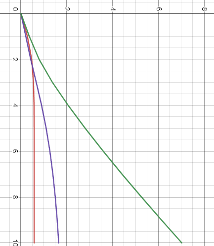

<p align="center">Министерство образования Республики Беларусь</p>
<p align="center">Учреждения образования</p>
<p align="center">“Брестский государственный технический университет”</p>
<p align="center">Кафедра информационных и интеллектуальных технологий</p>
<br><br><br><br><br><br><br>
<p align="center">Лабораторная работа №2</p>
<p align="center">По дисциплине “Теория и методы автоматического управления”</p>
<p align="center">Тема: “PID controllers”</p>
<br><br><br><br><br>
<p align="right">Выполнил:</p>
<p align="right">Студент 3 курса:</p>
<p align="right">Группы АС-63</p>
<p align="right">Поплавский В.В.</p>
<p align="right">Проверила:</p>
<p align="right">Ситковец Я. С.</p>
<br><br><br><br><br>
<p align="center">Брест 2024</p>
---

Задача:
На языке C++ реализовать программу, которая моделирует PID регулятор, обсуждаемый выше. Использовать математическую модель, полученную в предыдущей работе, в качестве объекта управления. Для использования ООП программа должна иметь как минимум 3 класса (+наследование).

Добавить информацию о разработанной программе (диаграмма классов и т.д.) в отчет, используя Doxygen (в формате .md).

Пример вывода программы:

``` bash
        Введите выбор (0 - выход, 1 - начать)
Выбор: 1    
Введите алгоритм функционирования системы
Ввод w(t): 3
Введите шаг
Ввод T0: 20
        Заполните данные для линейной модели
Ввод A: 0.2
Ввод B: 0.4
Ввод текущей температуры: 0.1
Ввод теплоты: 0.9
        Заполните данные для нелинейной модели
Ввод A: 0.45
Ввод B: 0.998
Ввод C: 0.876
Ввод D: 1.2
Ввод текущей температуры: 1.1
Ввод теплоты: 0.8

                                РЕЗУЛЬТАТЫ

                              Линейная модель

ВРЕМЯ (T0)      ОТКЛОНЕНИЕ (e)       ВЫХОДНАЯ ПЕРЕМЕННАЯ (Yt)       УПРАВЛЯЮЩЕЕ ВЛИЯНИЕ1 (Uk)
=====================================================================================
1              2.62                0.38                       91.7
2              2.564               0.436                      5264.24
3              2.5528              0.4472                     10393.2
4              2.55056             0.44944                    15499
5              2.55011             0.449888                   20600.2
6              2.55002             0.449978                   25700.4
7              2.55                0.449996                   30800.5
8              2.55                0.449999                   35900.5
9              2.55                0.45                       41000.5
10             2.55                0.45                       46100.5
11             2.55                0.45                       51200.5
12             2.55                0.45                       56300.5
13             2.55                0.45                       61400.5
14             2.55                0.45                       66500.5
15             2.55                0.45                       71600.5
16             2.55                0.45                       76700.5
17             2.55                0.45                       81800.5
18             2.55                0.45                       86900.5
19             2.55                0.45                       92000.5
20             2.55                0.45                       97100.5

                                РЕЗУЛЬТАТЫ

                              Нелинейная модель

ВРЕМЯ (T0)      ОТКЛОНЕНИЕ (e)       ВЫХОДНАЯ ПЕРЕМЕННАЯ (Yt)       УПРАВЛЯЮЩЕЕ ВЛИЯНИЕ (Uk)
=====================================================================================
1              0.943373            2.05663                    33.018
2              1.72047             1.27953                    1923.38
3              5.08384             -2.08384                   5462.61
4              4.01002             -1.01002                   15508.6
5              6.22659             -3.22659                   23633.1
6              3.90844             -0.908444                  35949.7
7              12.2372             -9.23724                   44116.1
8              6.41875             -3.41875                   68178.7
9              88.1327             -85.1327                   84021.6
10             51.4126             -48.4126                   256959
11             7256.31             -7253.31                   612874
12             5604.52             -5601.52                   1.48876e+07
13             5.25078e+07         -5.25078e+07               1.86372e+09
14             5.49428e+07         -5.49428e+07               1.05652e+11
15             2.75156e+15         -2.75156e+15               9.63047e+16
16             4.25087e+15         -4.25087e+15               5.5831e+18
17             7.55592e+30         -7.55592e+30               2.64457e+32
18             2.14339e+31         -2.14339e+31               1.56731e+34
19             5.69777e+61         -5.69777e+61               1.99422e+63
20             4.84134e+62         -4.84134e+62               1.29476e+65

TIME (T0)      DEVIATION (e)       OUTPUT VARIABLE (Yt)       CONTROLLING INFLUENCE (Uk)
=====================================================================================
1              2.62                0.38                       91.7
2              2.564               0.436                      5264.24
3              2.5528              0.4472                     10393.2
4              2.55056             0.44944                    15499
5              2.55011             0.449888                   20600.2
6              2.55002             0.449978                   25700.4
7              2.55                0.449996                   30800.5
8              2.55                0.449999                   35900.5
9              2.55                0.45                       41000.5
10             2.55                0.45                       46100.5
11             2.55                0.45                       51200.5
12             2.55                0.45                       56300.5
13             2.55                0.45                       61400.5
14             2.55                0.45                       66500.5
15             2.55                0.45                       71600.5
16             2.55                0.45                       76700.5
17             2.55                0.45                       81800.5
18             2.55                0.45                       86900.5
19             2.55                0.45                       92000.5
20             2.55                0.45                       97100.5

Обработка ошибок ввода также была добавлена:
Введите выбор (0 - выход, 1 - начать)
Выбор: 1  
Введите алгоритм функционирования системы
Ввод w(t): h

                ***Введенное значение некорректно***

Ввод w(t): 5
Введите шаг
Ввод T0: g

                ***Введенное значение некорректно***                              

## Графики

### График линейный модели


### Графики нелинейной модели


## Документы
Information about the developed program, created using [Doxygen](https://doxygen.nl/) to generate XML and [Moxygen](https://github.com/sourcey/moxygen) to turn XML into Markdown.

The resulting file is [doxygen.md](doxygen.md)

## Код

#### Код находится в [src folder](/trunk/as0006315/task_02/src).

- [CMakeLists.txt](/trunk/as000220021/task_01/src/CMakeLists.txt) - this is a file that contains CMake commands to control the project build process.
- [models.h](/trunk/as000220021/task_01/src/models.h) - header file, contains functions declarations for linear and nonlinear models simulation.
- [models.cpp](/trunk/as000220021/task_01/src/models.cpp) - source file, contains functions definitions for linear and nonlinear models simulation.
- [main.cpp](/trunk/as000220021/task_01/src/main.cpp) - source file, contains the main function that controls the program execution.
- [PID.h](/trunk/as000220021/task_01/src/PID.h) - header file, contains the declaration of the `PID` class, which is used to control the system by the PID algorithm.
- [PID.cpp](/trunk/as000220021/task_01/src/PID.cpp) - source file, contains the definition of the `PID` class, which is used to control the system by the PID algorithm.
