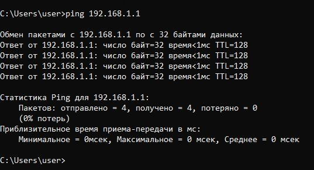
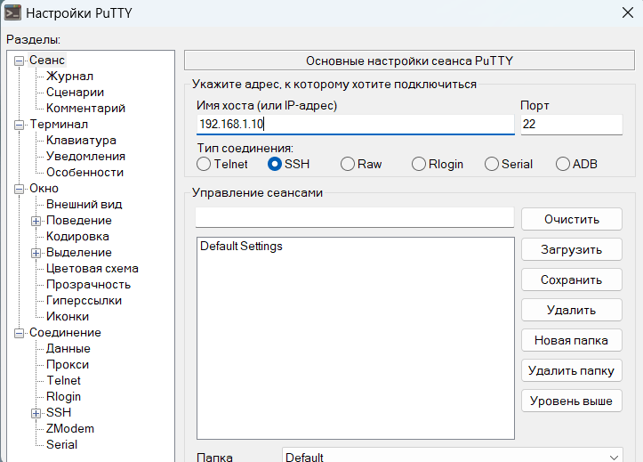
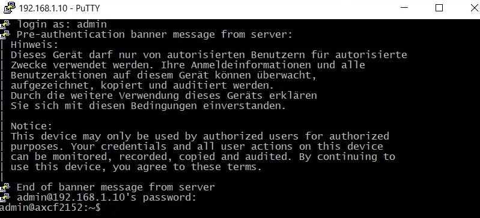
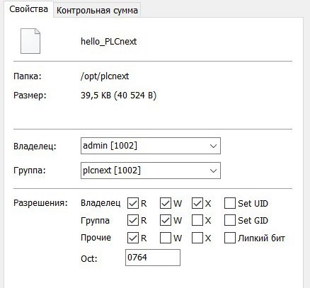
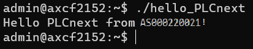

<p align="center">Министерство образования Республики Беларусь</p>
<p align="center">Учреждение образования</p>
<p align="center">«Брестский государственный технический университет»</p>
<p align="center">Кафедра ИИТ</p>
<br><br><br><br><br><br><br>
<p align="center">Лабораторная работа №3</p>
<p align="center">По дисциплине «Теория и методы автоматического управления»</p>
<p align="center">Тема: «Работа с контроллером AXC F 2152»</p>
<br><br><br><br><br>
<p align="right">Выполнил:</p>
<p align="right">Студент 3-го курса</p>
<p align="right">Группы АС-63</p>
<p align="right">Поплавский В. В.</p>
<p align="right">Проверила:</p>
<p align="right">Ситковец Я. С.</p>
<br><br><br><br><br>
<p align="center">Брест 2024</p>

---

## Задание: 
Создать тестовый проект "Hello PLCnext from AS0xxyy!" с использованием Visual Code, собрать проект и продемонстрировать его работоспособность на тестовом контроллере.

## Ход работы

### Этап подготовки
Для создания и сборки тестового проекта выполните следующие шаги:
1. Клонируйте репозиторий:
``` sh
git clone https://github.com/savushkin-r-d/PLCnext-howto
```
2. Настройте конфигурацию:
``` sh
cmake --preset=build-windows-AXCF2152-2021.0.3.35554 .
```
3. Соберите проект:
``` sh
cmake --build --preset=build-windows-AXCF2152-2021.0.3.35554 --target all
```
4. Разверните проект:
``` sh
cmake --build --preset=build-windows-AXCF2152-2021.0.3.35554 --target install
```

После развертывания исполняемый файл будет доступен по следующему пути:

> deploy\AXCF2152_21.0.3.35554\Release\bin\hello_PLCnext

### Этап подключения и настройки

После получения бинарного файла подключите контроллер к компьютеру и настройте сетевые параметры.


<br>
| _Новое значение IP-адреса версии 4_

Для проверки подключения выполните пинг контроллера с помощью команды `ping 192.168.1.1`.


<br>
| _Результат проверки соединения_

Необходимо ввести имя хоста (в данном случае IP-адресс - `192.168.1.10`), а также войти в систему __PuTTY Configuration__, используя логин __Admin__ и пароль, нанесённый на контроллере.


<br>
| _Окно настройки PuTTY_


<br>
| _Успешный вход в систему_

После установки соединения с контроллером, вводя те же данные, нужно авторизироваться и настроить __WinSCP__, чтобы в дальнейшем перенести бинарный файл на контроллер.


<br>
| _Окно WinSCP с введенными данными_

 Теперь необходимо перместить бинарный файл hello_PLCnext на контроллер и изменить его свойства, делая его исполняемым.

 
 <br>
 | _Информация о бинарном файле_

### Этап запуска программы

Теперь можно запустить исполняемый файл командой `./hello_PLCnext`.


<br>
| _Результат работы программы_
