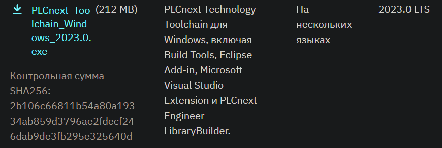

<p align="center">Министерство образования Республики Беларусь</p>
<p align="center">Учреждение образования</p>
<p align="center">«Брестский государственный технический университет»</p>
<p align="center">Кафедра ИИТ</p>
<br><br><br><br><br><br><br>
<p align="center">Лабораторная работа №4</p>
<p align="center">По дисциплине «Теория и методы автоматического управления»</p>
<p align="center">Тема: «Работа с контроллером AXC F 2152»</p>
<br><br><br><br><br>
<p align="right">Выполнил:</p>
<p align="right">Студент 3-го курса</p>
<p align="right">Группы АС-63</p>
<p align="right">Поплавский В. В.</p>
<p align="right">Проверила:</p>
<p align="right">Ситковец Я. С.</p>
<br><br><br><br><br>
<p align="center">Брест 2024</p>

---

## Задание:
Соберите проект ptusa_main в Visual Studio и продемонстрируйте его работоспособность на тестовом контроллере.

## Ход работы

### Подготовка

1. Клонировать репозиторий:
``` sh
git clone --recurse-submodules https://github.com/savushkin-r-d/ptusa_main
```

>Из-за большого объема проекта перед клонированием репозитория необходимо увеличить буфер для Git, выполнив команду -> `git config --global http.postBuffer 524288000`

2. Загрузите последнюю версию PLCnext Technology C++ Toolchain (2023.0 LTS) с сайта Phoenix Contact -> phoenixcontact.com. Затем откройте Visual Studio Installer и установите рабочую нагрузку .NET desktop development, после чего можно установить PLCnext Technology C++ Toolchain.


<br>
| _PLCnext для ОС Windows_

4. Теперь необходимо в `Visual Studio Installer` установить рабочую нагрузку **.NET desktop development**. После чего можно устанавливать `PLCnext Technology C++ Toolchain`.

5. Скачать `SDK` -> [phoenixcontact.com](https://www.phoenixcontact.com/ru-lt/produkty/kontroller-axc-f-2152-2404267?type=softw).


<br>
| _SDK для ОС Windows_

7. Скачайте SDK по ссылке: phoenixcontact.com. Установите SDK, используя соответствующую команду.
```sh
plcncli.exe install sdk –d [путь установки] –p [путь к архивному файлу]
```
В моем случае:
```sh
plcncli.exe install sdk –d C:\CLI\sdks\AXCF2152\ –p C:\Users\kseni\Downloads\SDK_for_Windows_64_V_2022_6\pxc-glibc-x86_64-mingw32-axcf2152-image-mingw-cortexa9t2hf-neon-axcf2152-toolchain-2022.6.tar.xz
```

### Сборка проекта

Теперь можно приступить к сборке проекта в Microsoft Visual Studio Community 2022. Выберите элемент запуска ptusa_main.exe.

### Подключение и настройка

Следуйте инструкциям в разделе Этап подключения и настройки из Лабораторной работы №3 до успешного входа в систему.

После этого создайте каталог в корневом каталоге контроллера, например, /opt/main/, и перенесите туда файлы с расширениями .lua и .plua, а также каталоги spec и sys из проекта T1-PLCnext-Demo, используя программу WinSCP.


<br>
| _Изменённые права доступа файла `ptusa_main`_

### Запуск программы

Чтобы запустить программу, выполните команду:
```sh
./ptusa_main  main.plua  sys_path ./sys/
```


<br>
| _Вывод программы_
