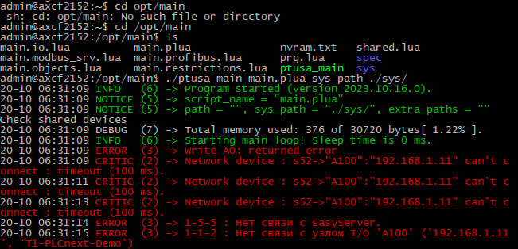

Министерство образования Республики Беларусь

Учреждение образования

“Брестский Государственный технический университет”

Кафедра ИИТ

      

<strong>Лабораторная работа №4</strong>

<strong>По дисциплине</strong> “Теория и методы автоматического управления”

<strong>Тема:</strong> “Работа с контроллером AXC F 2152”

      

<strong>Выполнил</strong>:

Студент 3 курса

Группы АС-63

Поплавский В. В.

<strong>Проверил:</strong>

Ситковец Я.С.

     

<strong>Брест 2024</strong>

---
**Задание**

а) Ознакомьтесь с общей информацией о платформе PLCnext здесь.
б) Изучите проект ptusa_main.
в) Соберите проект в Visual Studio и продемонстрируйте его работоспособность на тестовом контроллере.
г) Напишите отчет о выполненной работе в формате .md (readme.md) и с помощью pull request разместите его в каталоге: trunk\as000xxyy\task_04\doc.

<strong>Цель:</strong> собрать проект ptusa_main и продемонстрировать его функциональность на тестовом контроллере.

Для выполнения задачи начнем с компиляции файла <em>ptusa_main</em> в Visual Studio. Для этого клонируйте git-репозиторий с помощью следующей команды, которую можно ввести в терминале или командной строке:

bash

Copy
git clone --recurse-submodules https://github.com/savushkin-r-d/ptusa_main.git

После успешного клонирования репозитория переходите к сборке проекта.

По завершении сборки вы получите исполняемый файл <em>ptusa_main</em>.

После сборки необходимо установить соединение с контроллером через Ethernet.

Убедившись в успешном подключении к контроллеру, запустите исполняемый файл.

