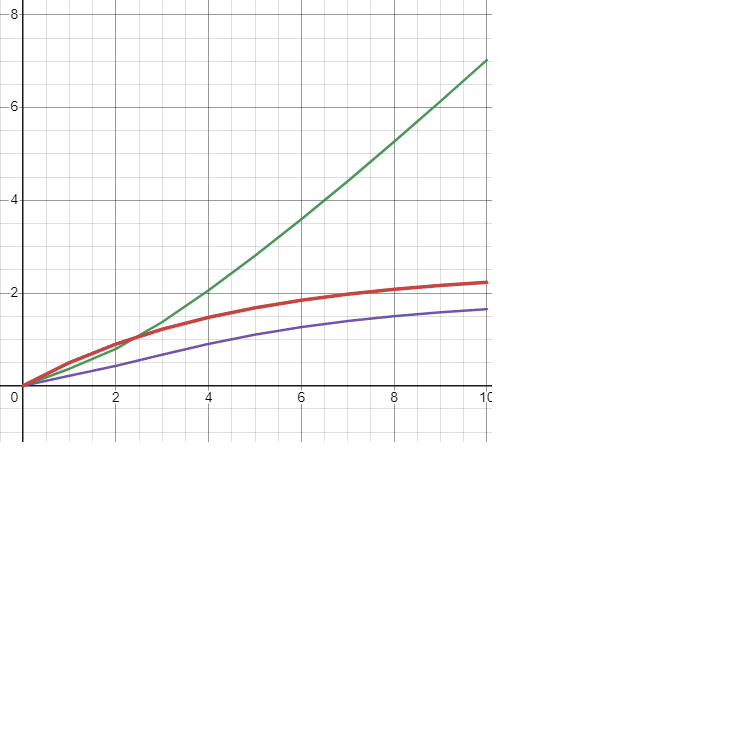

<p align="center">Министерство образования Республики Беларусь</p>
<p align="center">Учреждение образования</p>
<p align="center">“Брестский Государственный технический университет”</p>
<p align="center">Кафедра ИИТ</p>
<br><br><br><br><br><br>
<p align="center"><strong>Лабораторная работа №2</strong></p>
<p align="center"><strong>По дисциплине</strong> “Теория и методы автоматического управления”</p>
<p align="center"><strong>Тема:</strong> “ПИД-регуляторы”</p>
<br><br><br><br><br><br>
<p align="right"><strong>Выполнил</strong>:</p>
<p align="right">Студент 3 курса</p>
<p align="right">Группы АС-63</p>
<p align="right">Ващук А.В.</p>
<p align="right"><strong>Проверил:</strong></p>
<p align="right">Иванюк Д. С.</p>
<br><br><br><br><br>
<p align="center"><strong>Брест 2024</strong></p>

---
## Цель работы:  
Напишите программу на языке C++, которая моделирует работу ПИД-регулятора. В качестве объекта управления используйте математическую модель, которая была получилена в предыдущей работе. Реализуйте программу с использованием объектно-ориентированного подхода, включая не менее трех классов с использованием наследования. В отчете предоставить графики, демонстрирующие различные задания температуры объекта, и объяснить полученные результаты.
## Ход работы  
Была реализована программа на языке С++, моделирующая работу ПИД-регулятор. Для документирования программы был использован инструмент Doxygen, затем документация была преобразована в Markdown (.md). Результаты работы программы были записаны в файл results.txt.

---

<p align="center" style="font-size:25px;font-weight: bold">Вывод из консоли</p>

```console
        ---LinearModel and Nonlinearmodel---
Iteration 1:
Linear model output: 0.500000
Nonlinear model output: 0.284147
Error: 0.215853
Control signal: 0.366950

Iteration 2:
Linear model output: 0.900000
Nonlinear model output: 0.471095
Error: 0.428905
Control signal: 0.793894

Iteration 3:
Linear model output: 1.220000
Nonlinear model output: 0.550058
Error: 0.669942
Control signal: 1.375500

Iteration 4:
Linear model output: 1.476000
Nonlinear model output: 0.572912
Error: 0.903088
Control signal: 2.058610

Iteration 5:
Linear model output: 1.680800
Nonlinear model output: 0.578363
Error: 1.102440
Control signal: 2.802420

Iteration 6:
Linear model output: 1.844640
Nonlinear model output: 0.579586
Error: 1.265050
Control signal: 3.590220

Iteration 7:
Linear model output: 1.975710
Nonlinear model output: 0.579856
Error: 1.395860
Control signal: 4.412580

Iteration 8:
Linear model output: 2.080570
Nonlinear model output: 0.579915
Error: 1.500650
Control signal: 5.262510

Iteration 9:
Linear model output: 2.164460
Nonlinear model output: 0.579928
Error: 1.584530
Control signal: 6.134460

Iteration 10:
Linear model output: 2.231560
Nonlinear model output: 0.579931
Error: 1.651630
Control signal: 7.024030
Press any key to continue . . .
```

<p align="center" style="font-size:25px;font-weight: bold">Графики</p>
<p align="center">
<p align="center"> 
<p align="center">
<p align="center"> 
