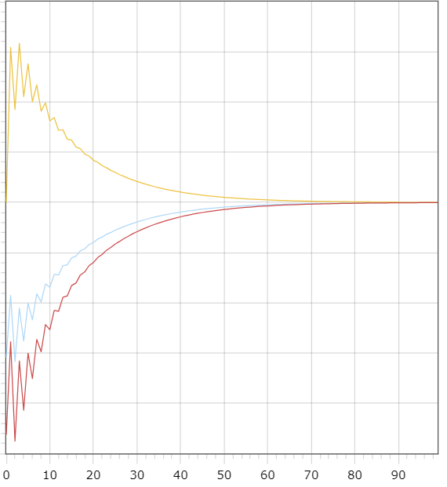
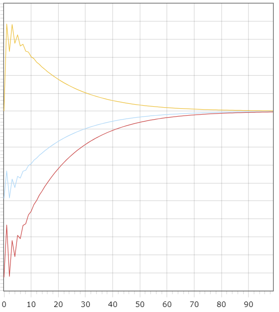

 Министерство образования Республики Беларусь

Учреждение образования

“Брестский Государственный технический университет”

Кафедра ИИТ

       

Лабораторная работа №2

По дисциплине “Теория и методы автоматического управления”

Тема: “ПИД-регуляторы”

     

Выполнил:

Студент 3 курса

Группы АС-63

Грицук П.Э.

Проверил:

Иванюк Д. С.

     

Брест 2024

---

## Цель работы:  
Создать программу на C++, которая будет моделировать работу ПИД-регулятора. В качестве объекта управления использовать математическую модель, полученную в предыдущей работе. Программа должна быть реализована с использованием объектно-ориентированного подхода и содержать не менее трех классов, включая наследование. В отчете необходимо предоставить графики для различных температурных заданий объекта, а также предоставить пояснения к полученным результатам. Отчет должен быть сгенерирован с помощью Doxygen в формате .md.

## Реализация  
В результате работы была разработана программа, моделирующая работу ПИД-регулятора. Документация к проекту была подготовлена с использованием Doxygen и сохранена в файле `doxygen.md`. 

Результаты работы программы следующие:  
- Описание поведения ПИД-регулятора в зависимости от различных параметров.
- Графики для различных температурных заданий объекта.
- Пояснения к полученным результатам, включая анализ точности работы регулятора и его отклонений при изменении параметров.

Дополнительно в отчете приведены выводы о влиянии настроек ПИД-контроллера на стабильность системы управления.

## Результаты  
### Линейная модель:  
При следующих значениях: T = 10, TP = 10, TM = 50, K = 0.1  
Желаемое значение W = 5, A = 0.333, B = 0.667  

### Нелинейная модель: 
При следующих значениях: T = 10, TP = 10, TM = 50, K = 0.1  
Желаемое значение W = 5, A = 1, B = 0.0033, C = 0.525, D = 0.525
