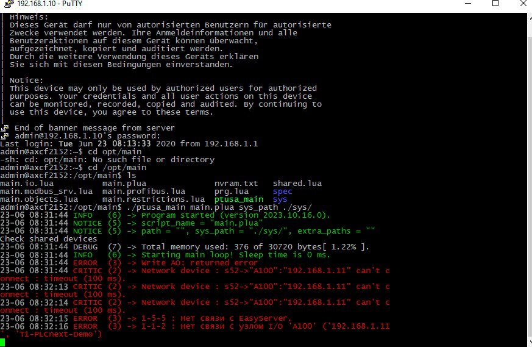

<p align="center">Министерство образования Республики Беларусь</p>
<p align="center">Учреждение образования</p>
<p align="center">“Брестский Государственный технический университет”</p>
<p align="center">Кафедра ИИТ</p>
<br><br><br><br><br><br><br>
<p align="center">Лабораторная работа №4</p>
<p align="center">По дисциплине “Теория и методы автоматического управления”</p>
<p align="center">Тема: "Работа с контроллером AXCF 2152"</p>
<br><br><br><br><br>
<p align="right">Выполнил:</p>
<p align="right">Студент 3 курса</p>
<p align="right">Группы АС-63</p>
<p align="right">Грицук П.Э.</p>
<p align="right">Проверил:</p>
<p align="right">Иванюк Д. С.</p>
<br><br><br><br><br>
<p align="center">Брест 2024</p>

---

## лабораторная работа №4

---
## Цель:  
Собрать проект в Visual Studio и запустить его на тестовом контроллере.

---

## Ход работы: 

1. В соответствии с заданием клонируем репозиторий [ptusa_main](https://github.com/savushkin-r-d/ptusa_main).

2. Открываем клонированный репозиторий в Visual Studio, где создаем проект на основе CMake и компилируем его.

3. Для подключения к контроллеру выполняем действия, описанные в третьей лабораторной работе:
   [task_03](https://github.com/brstu/TMAU-2024/blob/main/trunk/as0006304/task_03/doc/README.md)

4. Переходим в папку с проектом и запускаем программу командой:

    ```bash
    ./ptusa_main main.plua sys_path ./sys/
    ```

## Консольный вывод: ##  




---

## Вывод: 
В ходе лабораторной работы были освоены навыки работы с Visual Studio. Проект успешно собран и запущен, что позволило получить практический опыт работы с тестовым контроллером AXC F 2152.
