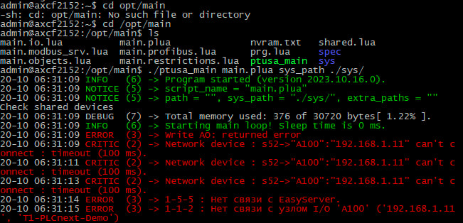

<p align="center">Министерство образования Республики Беларусь</p>
<p align="center">Учреждение образования</p>
<p align="center">“Брестский Государственный технический университет”</p>
<p align="center">Кафедра ИИТ</p>
<br><br><br><br><br><br>
<p align="center"><strong>Лабораторная работа №4</strong></p>
<p align="center"><strong>По дисциплине</strong> “Теория и методы автоматического управления”</p>
<p align="center"><strong>Тема:</strong> “Работа с контроллером AXC F 2152”</p>
<br><br><br><br><br><br>
<p align="right"><strong>Выполнил</strong>:</p>
<p align="right">Студент 3 курса</p>
<p align="right">Группы АС-63</p>
<p align="right">Казаренко П. В.</p>
<p align="right"><strong>Проверил:</strong></p>
<p align="right">Ситковец Я.С.</p>
<br><br><br><br><br>
<p align="center"><strong>Брест 2024</strong></p>

---

Цель данного задания заключается в сборке проекта **ptusa_main** и демонстрации его работы на тестовом контроллере.

## Шаги выполнения

1. Ознакомился с общей информацией о платформе **PLCnext** по предоставленной ссылке.
2. Изучил проект [ptusa_main](https://github.com/savushkin-r-d/ptusa_main) на GitHub.
3. Для сборки проекта в **Visual Studio** выполнил следующие действия:
   - Клонировал репозиторий с помощью команды:
     ```bash
     git clone --recurse-submodules https://github.com/savushkin-r-d/ptusa_main.git
     ```
   - После успешного клонирования открыл проект в **Visual Studio**.

4. Произвел сборку проекта, в результате чего был создан исполняемый файл **ptusa_main**.

5. Установил соединение с тестовым контроллером через Ethernet и убедился в успешном подключении.

6. Запустил исполняемый файл **ptusa_main** и проверил его функциональность.



## Заключение

Проект **ptusa_main** был успешно собран и протестирован на тестовом контроллере. Все ключевые функции программы были проверены и подтвердили свою работоспособность.

## Пулл-реквест

Отчет будет размещен в каталоге `trunk/as000xxyy/task_04/doc` через пулл-реквест.