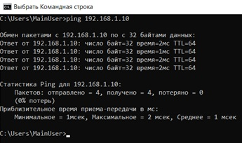

Министерство образования Республики Беларусь

Учреждение образования

“Брестский Государственный технический университет”

Кафедра ИИТ

      

<strong>Лабораторная работа 3</strong>

<strong>По дисциплине</strong> “Теория и методы автоматического управления”

<strong>Тема:</strong> “Работа с контроллером AXC F 2152”

      

<strong>Выполнил</strong>:

Студент 3 курса

Группы АС-63

Колодич М.П.

<strong>Проверил:</strong>

Ситковец Я.С.

     

<strong>Брест-2024</strong>

---

**Задание**

1. Ознакомиться с общей информацией о платформе **PLCnext** [здесь](https://www.plcnext.help/te/About/Home.htm).
2. Изучить [руководство](https://github.com/savushkin-r-d/PLCnext-howto/tree/master/HowTo%20build%20program%20Hello%20PLCnext).
3. Используя Visual Code создать тестовый проект *"Hello PLCnext from AS0xxyy!"*, собрать его и продемонстрировать работоспособность на тестовом контроллере.
4. Написать отчет по выполненной работе в .md формате (readme.md) и с помощью pull request разместить его в следующем каталоге: trunk\as000xxyy\task03\doc.

<strong>Цель:</strong> Создать и протестировать проект "Привет, PLCnext от AS0xxyy!", собрать его и продемонстрировать функциональность на целевом контроллере.

<strong>Решение:</strong>

Для выполнения задания, первым шагом будет клонирование нужного репозитория.

Для компиляции исходного файла <em>hello_PLCnext</em> применим следующие команды:

<pre>
cmake --preset=build-windows-AXCF2152-2021.0.3.35554 .
cmake --build --preset=build-windows-AXCF2152-2021.0.3.35554 --target all
cmake --build --preset=build-windows-AXCF2152-2021.0.3.35554 --target install
</pre>

Подключаем контроллер и настраиваем его сетевые параметры для корректного взаимодействия с ПК.

Обязательно проверяем правильность установленного соединения с устройством.

Используем программу <em>PuTTY Configuration</em> для подключения к контроллеру через терминал.

Вводим логин и пароль для авторизации на контроллере.

Запускаем <em>WinCP</em> для копирования файлов на контроллер.

Перемещаем собранный проект в корневую директорию контроллера и устанавливаем необходимые права доступа для его выполнения.

Запускаем проект и проверяем его работу.

<strong>Вывод:</strong> В процессе выполнения проекта был создан тестовый проект "Привет, PLCnext от AS0xxyy!", что помогло углубить знания по работе с контроллером <em>AXC F 2152</em> и настройке взаимодействия с ним.
