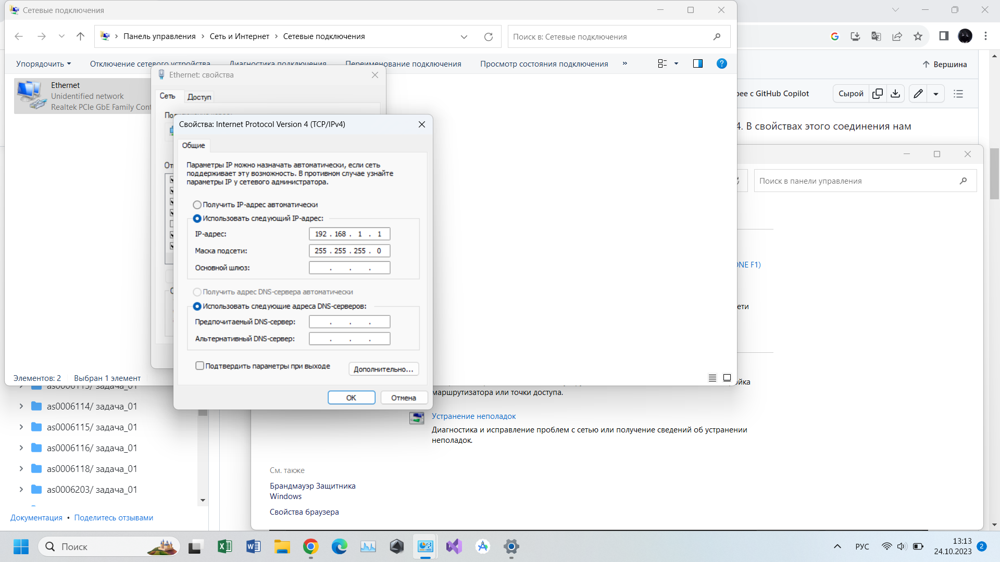
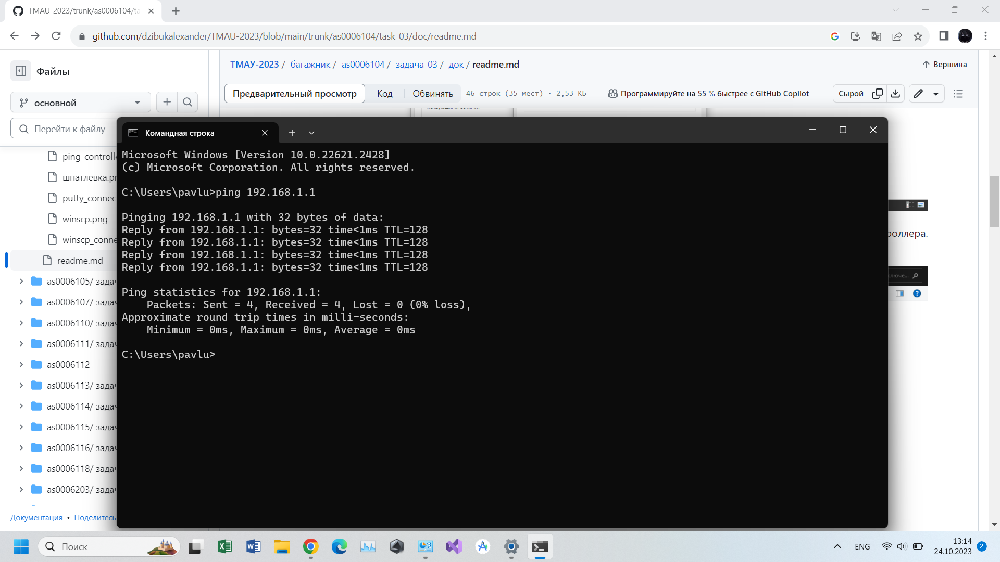
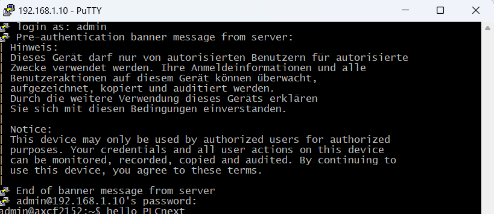
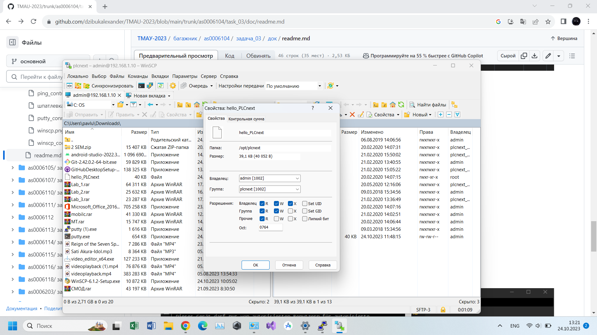
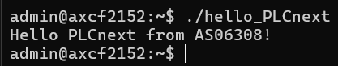

<p align="center">Ministry of Education of the Republic of Belarus</p>
<p align="center">Educational Institution</p>
<p align="center">“Brest State Technical University”</p>
<p align="center">Department of Computer Science and Information Technology</p>
<br><br><br>
<p align="center">Laboratory work No. 3</p>
<p align="center">on the discipline “Theory and methods of automatic control”</p>
<p align="center">Topic: “Working with the AXC F 2152 controller”</p>
<br><br><br>
<p align="right">Performed by:</p>
<p align="right">Student of 3rd year</p>
<p align="right">Group AS-63</p>
<p align="right">Kozlovich A. A.</p>
<p align="right">Supervised by:</p>
<p align="right">Sitkovets Y. S.</p>
<br><br><br>
<p align="center">Brest 2024</p>

---
<p> <strong>Objective:</strong> create a test project "Hello PLCnext from AS0xxyy!", build it, and demonstrate its functionality on a test controller.</p>

<p> <strong>Procedure:</strong> </p>
<p>To achieve the task, first, you need to build the <em>hello_PLCnext</em> file in Visual Studio. The following commands are used to build the file:</p>

 ``` bash
cmake --preset=build-windows-AXCF2152-2021.9.0.40 .
```

 ``` bash
cmake --build --preset=build-windows-AXCF2152-2021.9.0.40 --target all .
```

 ``` bash
cmake --build --preset=build-windows-AXCF2152-2021.9.0.40 --target install .
```

### Get the `hello_PLCnext` file.

### After building the executable file, connect to the controller via Ethernet connection.



### Check the controller connection.



### Open the `PuTTY Configuration` program and connect to the controller. Enter the login and password.



### Open the `WinSCP` program and connect to the controller.


### Add the built project to the root of the controller and change its permissions to allow execution.



### Run the executable file and receive the output "Hello PLCnext from AS06308!"


