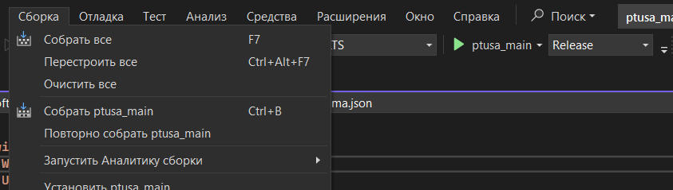
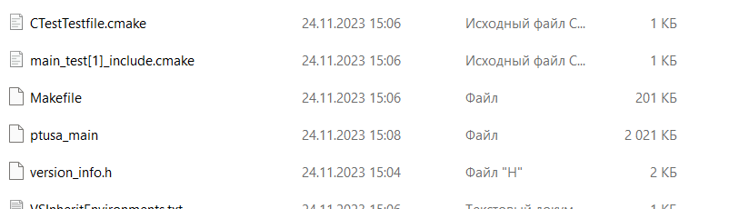
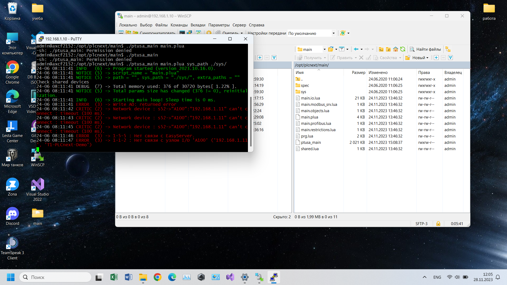

<p align="center">Ministry of Education of the Republic of Belarus</p>
<p align="center">Educational Institution</p>
<p align="center">"Brest State Technical University"</p>
<p align="center">Department of Computer Systems</p>
<br><br><br>
<p align="center">Laboratory work No. 4</p>
<p align="center">On the discipline "Theory and methods of automatic control"</p>
<p align="center">Topic: "Working with AXC F 2152 controller"</p>
<br><br><br>
<p align="right">Performed by:</p>
<p align="right">Student of 3rd course</p>
<p align="right">Group AS-63</p>
<p align="right">Kozlovich A. A.</p>
<p align="right">Checked by:</p>
<p align="right">Sitkovets Y. S.</p>
<br><br><br>
<p align="center">Brest 2024</p>

---

### Purpose:
to build a test project ptusa_main and demonstrate its operability on a test controller.

### Work process:
To solve the problem, first of all you need to build the file **ptusa_main** in Visual Studio. To build the file, you need to clone the repository, for this you can use the following command:

 ``` bash
git clone --recurse-submodules https://github.com/savushkin-r-d/ptusa_main.git 
```

After cloning the repository, we build the project.



We obtain the *ptusa_main* file.



After building the executable file, we connect to the controller via an Ethernet connection. This procedure was performed in lab №3.

``` bash
https://github.com/brstu/TMAU-2023/tree/main/trunk/as0006113/task_03/doc
```

After connecting and checking, we run the executable file.


