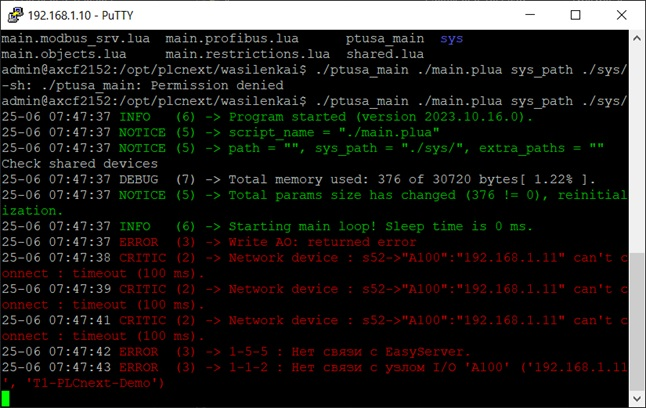
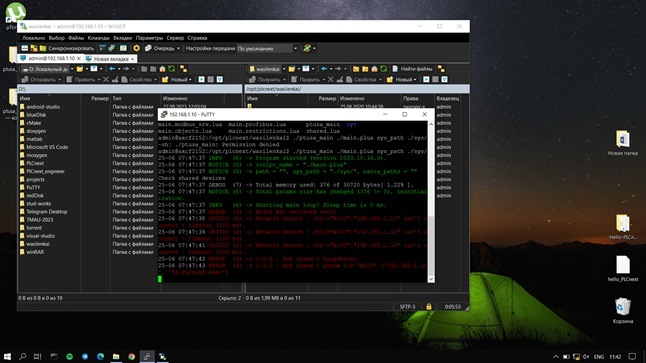

<p align="center">Ministry of Education of the Republic of Belarus</p>
<p align="center">Educational Institution</p>
<p align="center">"Brest State Technical University"</p>
<p align="center">Department of Computer Systems and Technologies</p>
<br><br><br>
<p align="center">Laboratory work #4</p>
<p align="center">On the discipline "Theory and methods of automatic control"</p>
<p align="center">Theme: "Working with controller AXC F 2152"</p>
<br><br><br>
<p align="right"><strong>Performed by:</strong></p>
<p align="right">Student of 3rd course</p>
<p align="right">Group AS-63</p>
<p align="right">Kozlovskaya A. G.</p>
<br>
<p align="right"><strong>Checked by:</strong></p>
<p align="right">Sitkovets Y. S.</p>
<br><br><br>
<p align="center">Brest 2024</p>

---
<p> <strong>Purpose: </strong>using <em>Visual Studio</em> to build this project and demonstrate its functionality on a test controller.</p>

Task: [#4](../../../tasks/task_04/readme.md).
<p> <strong>Solution:</strong> </p>
<ul>
<li>According to the task of laboratory work #4, clone the repository <a href="https://github.com/savushkin-r-d/ptusa_main">ptusa_main</a>.</li>
<li><p>Open this repository (in <em>Visual Studio</em>). Thus, we obtain a project based on <em>CMake</em>.</p></li>
<li><p>Using <em>Visual Studio</em>, build this project.</p></li>
<li><p>Then connect to the test controller <em>AXC F 2152</em> in laboratory work #3 -> <a href="../task_03/doc/readme.md">task_03</a>.</p></li>

<li><p>Navigate to the project folder, after transferring it to the controller, and run our program:</p></li>

``` sh
./ptusa_main  main.plua  sys_path  ./sys/
```

<li><p>We get the following output of our program on the console: </p></li>

</ul>





<p> <strong>Conclusion:</strong> During the course of this laboratory work, we gained valuable experience working with <em>Visual Studio</em> and the <em>AXC F 2152</em> controller, which is an important step in mastering programming skills and working with automated systems. Additionally, it can be noted that such practical sessions allow us not only to consolidate theoretical knowledge, but also to develop the ability to solve real technical problems, which is a key aspect of engineering activity.
<p>Working with the <em>AXC F 2152</em> opens up opportunities for creating scalable and flexible automation systems. This device, thanks to its power and multifunctionality, allows us to implement complex projects in the field of industrial automation. Our new skills working with this controller can be applied in various projects, ranging from simple monitoring and control tasks to complex systems requiring integration with other devices and services.</p>
<p>We also continued to explore the capabilities provided by the Visual Studio development environment, as it is one of the leading platforms for software development. Mastering additional features and tools of this environment will allow us to increase the efficiency of development and the quality of the final product.</p>


   


     


      
       
        
         
          

          
