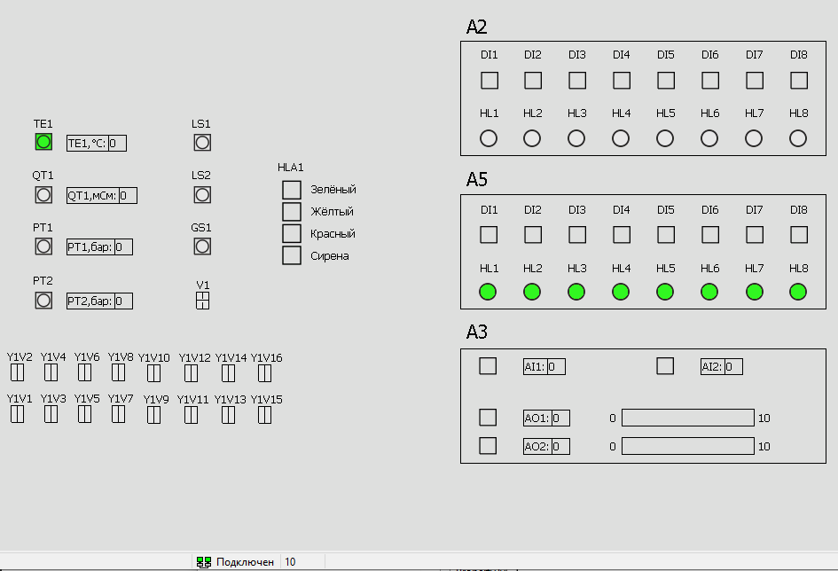

<p align="center">Ministry of Education of the Republic of Belarus</p>
<p align="center">Educational Institution</p>
<p align="center">«Brest State Technical University»</p>
<p align="center">Department of Computer Systems and Networks</p>
<br><br><br><br><br><br><br>
<p align="center">Laboratory work #5</p>
<p align="center">On the discipline «Theory and methods of automatic control»</p>
<p align="center">Topic: «Working with AXC F 2152 controller»</p>
<br><br><br><br><br>
<p align="right">Performed by:</p>
<p align="right">Student of the 3rd year</p>
<p align="right">Group AS-63</p>
<p align="right">Kozlovskaya A. G.</p>
<p align="right">Checked by:</p>
<p align="right">Sitkovets Y. S.</p>
<br><br><br><br><br>
<p align="center">Brest 2024</p>

---

# Task:
Deploy the **T1-PLCnext-Demo** project locally and on a test controller and demonstrate its operation. Also, make changes to the description of the control program.

# Work Progress

## Deploy the **T1-PLCnext-Demo** project locally

### Preparation

1. First, clone the **T1-PLCnext-Demo** repository to a local file directory:
```sh
git clone --recurse-submodules https://github.com/savushkin-r-d/T1-PLCnext-Demo
```

2. After that, you need to download and install the latest version of the [Git LFS](https://git-lfs.com/) application.
3. Now you need to clone the repository containing the components **EasyServer**, **Monitor** and **DbEditorXML**, using the command:
```sh
git clone --recurse-submodules https://github.com/savushkin-r-d/SCADA-ptusa-bin
```
 4. The next step is to configure **DbEditorXML**. Run **DbEditorXML.exe**, add the driver *T1_PLCNext_Demo.cdbx* and check the IP address, which should be `127.0.0.1`. Then, run the **Bugger.exe** application to check the correctness of the server load.
 5. Next, you need to configure **EasyServer**. Run this component from the cloned repository, and then, following the [instructions](https://github.com/savushkin-r-d/T1-PLCnext-Demo?tab=readme-ov-file#клонирование-проекта), configure this file.
<br> After configuration, you can run the project in the **EasyServer** program, located at: `"C:\Users\Ann\Documents\GitHub\SCADA-ptusa-bin\projects\T1_PLCNext_Demo.mpr"`.
 6. Now you can proceed to install and configure **Monitor**. Run the **Monitor.exe** file, in the projects menu, add the file *T1_PLCNext_Demo.mpr*. Open the project with the data `Username` - `user` and `Server` - `localhost`.


### Building and running

To test the project, select "File" -> "Open workspace from file" -> "Select the workspace file: (D:\PTUSA-projects\T1_PLCNext_Demo\project.code-workspace)" from the top menu.

Run **EasyServer** and **Monitor**. Then you can run the project. To do this, _Visual Studio Code_ was used.

In **Monitor**, all devices of the test stand project *T1_PLCNext_Demo* will be visible with the ability to control.


<br>
| _Monitor_

## Running on the controller

To run on the controller, you need the _ptusa_main_ file - the result of [Laboratory work #4](../../task_04/doc/readme.md). The instructions for building and connecting are also specified there.

The conditions required changing the _main.plau_ file. The following changes were made:
```plau
function user_init()
    local DELTA = 200
    A5HL1_info.start_time = get_millisec()
    A5HL3_info.start_time = A5HL1_info.start_time - DELTA
    A5HL5_info.start_time = A5HL3_info.start_time - DELTA
    A5HL7_info.start_time = A5HL5_info.start_time - DELTA
    A5HL2_info.start_time = A5HL7_info.start_time - DELTA
    A5HL4_info.start_time = A5HL2_info.start_time - DELTA
    A5HL6_info.start_time = A5HL4_info.start_time - DELTA
    A5HL8_info.start_time = A5HL6_info.start_time - DELTA
end
```

The main points:
- `local DELTA = 200` - sets an interval of 200 milliseconds between the start times of objects.
- `A5HL1_info.start_time = get_millisec()` - sets the start time for A5HL1_info as the current time in milliseconds.
- `A5HL3_info.start_time = A5HL1_info.start_time - DELTA` - sets the start time for A5HL3_info 200 milliseconds less than A5HL1_info.
- `A5HL5_info.start_time = A5HL3_info.start_time - DELTA` - sets the start time for A5HL5_info 200 milliseconds less than A5HL3_info.
<br>And so on for the remaining objects.

Thus, the presented code changes the order of the lights turning on.


       


           


               