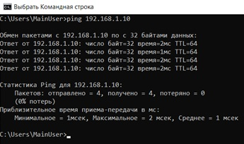
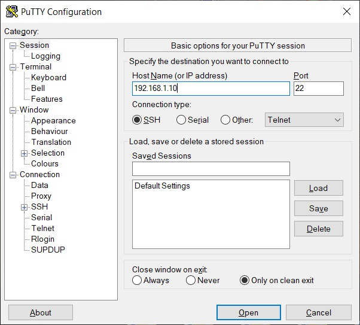

<p align="center">Министерство образования Республики Беларусь</p>
<p align="center">Учреждение образования</p>
<p align="center">“Брестский Государственный технический университет”</p>
<p align="center">Кафедра ИИТ</p>
<br><br><br><br><br><br>
<p align="center"><strong>Лабораторная работа №3</strong></p>
<p align="center"><strong>По дисциплине</strong> “Теория и методы автоматического управления”</p>
<p align="center"><strong>Тема:</strong> “Работа с контроллером AXC F 2152”</p>
<br><br><br><br><br><br>
<p align="right"><strong>Выполнила</strong>:</p>
<p align="right">Студентка 3 курса</p>
<p align="right">Группы АС-63</p>
<p align="right">Крагель А.М.</p>
<p align="right"><strong>Проверил:</strong></p>
<p align="right">Ситковец Я. С.</p>
<br><br><br><br><br>
<p align="center"><strong>Брест 2024</strong></p>

---
<p> <strong>Цель:</strong> Реализовать тестовый проект "Hello PLCnext from AS0xxyy!", собрать его и показать работу на тестовом контроллере.</p> 

1. Ознакомиться с общей информацией о платформе **PLCnext** [здесь](https://www.plcnext.help/te/About/Home.htm).
2. Изучить [руководство](https://github.com/savushkin-r-d/PLCnext-howto/tree/master/HowTo%20build%20program%20Hello%20PLCnext).
3. Используя **Visual Code** создать тестовый проект *"Hello PLCnext from AS0xxyy!"*, собрать его и продемонстрировать работоспособность на тестовом контроллере.
4. Написать отчет по выполненной работе в .md формате (readme.md) и с помощью pull request разместить его в следующем каталоге: trunk\as000xxyy\task_03\doc.

<p> <strong>Ход работы:</strong> </p>
<p>Первым делом делаем копию репозиторий.</p>
<p>Собираем файл <em>hello_PLCnext</em> пользусь командами:</p>


 ``` bash
cmake --preset=build-windows-AXCF2152-2021.0.3.35554 .
```


 ``` bash
cmake --build --preset=build-windows-AXCF2152-2021.0.3.35554 --target all
```


 ``` bash
cmake --build --preset=build-windows-AXCF2152-2021.0.3.35554 --target install
```

<p>Дальше делаем подключение к контроллеру, настраиваем сеть и проверяем подключение.</p>

  

  

<p>Вскрываем программу <em>PuTTY Configuration</em> и подключаемся к контроллеру.</p>

 

<p>Вводим данные, такие как: логин, пароль. Это нужно чтобы подключиться к контроллеру.</p>

 

<p>Вскрываем программу <em>WinCP</em> и подключаемся к контроллеру.</p>

 

<p>Сохраняем реализованный проект в корень контролера и изменяем разрешения, для входа.</p>

 

<p>Запускаем проект и видим сдежующий вывод.</p>

 

<p> <strong> Вывод:</strong> В данной лабораторной работе был реализован тестовый проект "Hello PLCnext from AS0xxyy!" и  была изученна полезная информация для работы с контроллером <em>AXC F 2152</em></p>