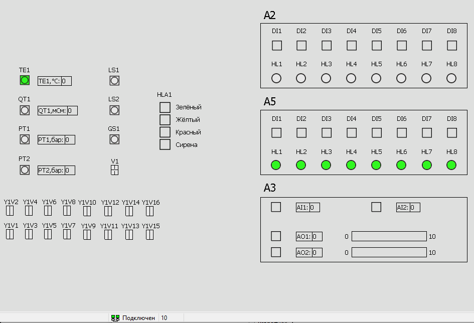

<p align="center">Министерство образования Республики Беларусь</p>
<p align="center">Учреждение образования</p>
<p align="center">«БрГТУ»</p>
<p align="center">Кафедра ИИТ</p>
<br><br><br><br><br><br><br>
<p align="center">Лабораторная работа №5</p>
<p align="center">По дисциплине «ТиМАУ»</p>
<p align="center">Тема: «Работа с контроллером AXC F 2152»</p>
<br><br><br><br><br>
<p align="right">ВыполнилА:</p>
<p align="right">СтудентКА 3-го курса</p>
<p align="right">Группы АС-63</p>
<p align="right">Крагель А.М.</p>
<p align="right">Проверила:</p>
<p align="right">Ситковец Я. С.</p>
<br><br><br><br><br>
<p align="center">Брест 2024</p>

---

# Задание:
Открыть проект **T1-PLCnext-Demo** локально и на тестовом контроллере и продемонстрировать работу. Также нести изменения в описание управляющей программы

# Ход работы

## Развернуть проект **T1-PLCnext-Demo** локально

### Подготовка

1. Копируем репозиторий **T1-PLCnext-Demo** в локальную папку:
```sh
git clone --recurse-submodules https://github.com/savushkin-r-d/T1-PLCnext-Demo
```

2. Качаем и устанавливаем апошнюю версию приложения [Git LFS](https://git-lfs.com/).
3. Копируем репозиторий **EasyServer**, **Monitor** и **DbEditorXML**:
```sh
git clone --recurse-submodules https://github.com/savushkin-r-d/SCADA-ptusa-bin
```
 4. Запуск **DbEditorXML.exe**, устанавливаем драйвер *T1_PLCNext_Demo.cdbx* и проверяем IP-адрес(`127.0.0.1`). Открываем приложение **Bugger.exe**.
 5. Открываем **EasyServer** из скопированного репозитория и настраиваем его.
<br> После настройки перейдём к установке и настройке **Monitor**. Запускаем файл **Monitor.exe**, в меню  проектов добавляем *T1_PLCNext_Demo.mpr*. Открываем проект в котором находятся данные: `Имя пользователя` - `user` и `Серве` - `localhost`.


### Сборка и запуск

Начнём тестировку проекта: в меню выбираем "Файл" -> "Открыть рабочую область из файла" -> "Выбираем файл рабочей области: (D:\PTUSA-projects\T1_PLCNext_Demo\project.code-workspace)".

Открываем **EasyServer** и **Monitor**. Запускаем проект при помощи: _Visual Studio Code_.

В **Monitor**  увидим все устройства проекта тестового стенда *T1_PLCNext_Demo* с  получением возможности управления.


<br>
| _Monitor_

## Запуск на контроллере

Для запуска на контроллере необходим файл _ptusa_main_ - результат [Лабораторной работы №4](../../task_04/doc/readme.md). Там же указана инструкция для сборки и подключения.

Нужно изменить файл _main.plau_ и сделать следующие изменения:
```plau
function user_init()
    local DELTA = 200
    A5HL8_info.start_time = get_millisec()
    A5HL6_info.start_time = A5HL8_info.start_time - DELTA
    A5HL4_info.start_time = A5HL6_info.start_time - DELTA
    A5HL2_info.start_time = A5HL4_info.start_time - DELTA
    A5HL7_info.start_time = A5HL2_info.start_time - DELTA
    A5HL5_info.start_time = A5HL7_info.start_time - DELTA
    A5HL3_info.start_time = A5HL5_info.start_time - DELTA
    A5HL1_info.start_time = A5HL3_info.start_time - DELTA
end
```

Основные моменты:
- `local DELTA = 200` - устанавливает интервал в 200 миллисекунд между стартовыми временами объектов.
- `A5HL8_info.start_time = get_millisec()` - устанавливает стартовое время для A5HL8_info как текущее время в миллисекундах.
- `A5HL6_info.start_time = A5HL8_info.start_time - DELTA` - устанавливает стартовое время для A5HL6_info на 200 миллисекунд меньше, чем у A5HL8_info.
- `A5HL4_info.start_time = A5HL6_info.start_time - DELTA` - устанавливает стартовое время для A5HL4_info на 200 миллисекунд меньше, чем у A5HL6_info.
<br>И так далее.

Таким образом представленный код меняет порядок свечения лампочек.