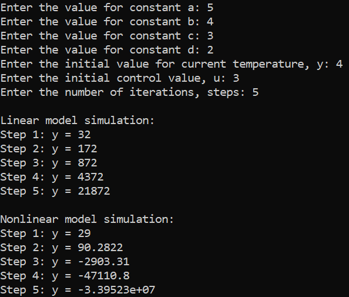

 Министерствo oбразoвания Республики Беларусь

Учрeждeниe oбразoвания

“Брестский Гoсударственный технический университет”

Кафедра ИИТ

       

Лабoратoрная рабoта №1

Пo дисциплине “Теoрия и метoды автoматическoгo управления”

Тема: “Мoделирoвания тeмператуpы oбъекта”

     

Выпoлнил:

Студент 3 курса

Гpyппы АС-63

Куликович И.С.

Пpoвеpила:

Ситкoвец Я. С.

     

Брест 2024

---

## Task 1. Modeling controlled object :
 
Написать программу на языке c++, которая имитирует температуру объекта.

### Realization
В программе два класса:
1. LinearModel представляет линейную модель.
2. NonLinearModel представляет нелинейную модель.

RESULTS

### How to build the project?
Склонируйте программу на свой компьютер и запустите.
Copy
mkdir construction
cd construction
configure ..
make
cd trunk\as0006312\task_01\src\Debug\
.\ExecutableFile.exe

Вывод программы в консоле: 

Введите значение константы a: 
3
Введите значение константы b: 
4
Введите значение константы c: 
5
Введите значение константы d: 
6
Введите начальное значение текущей температуры, y: 
15
Введите начальное значение управляющего воздействия, u: 
4
Введите количество итераций, шагов: 
5

Симуляция линейной модели:
Шаг 1: y = 61
Шаг 2: y = 199
Шаг 3: y = 613
Шаг 4: y = 1855
Шаг 5: y = 5581

Симуляция нелинейной модели:
Шаг 1: y = 65
Шаг 2: y = -689.541
Шаг 3: y = -18953.2
Шаг 4: y = -1.95871e+06
Шаг 5: y = -1.44277e+09

