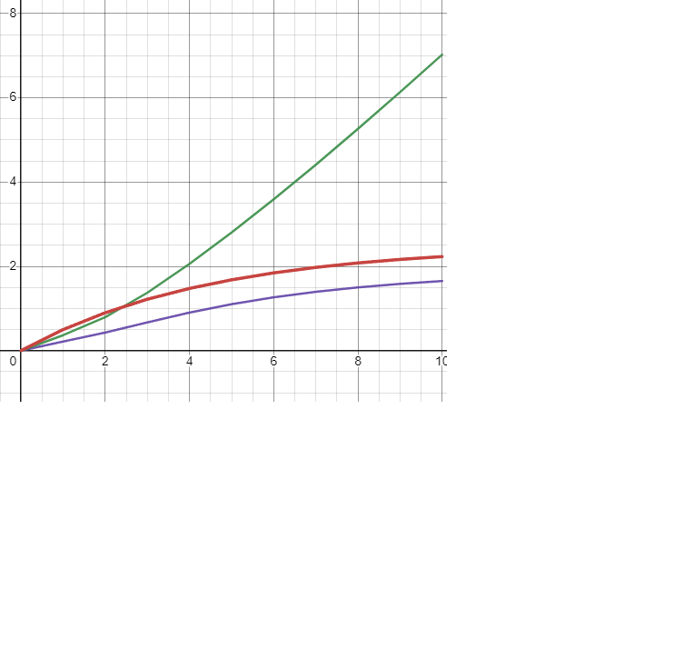
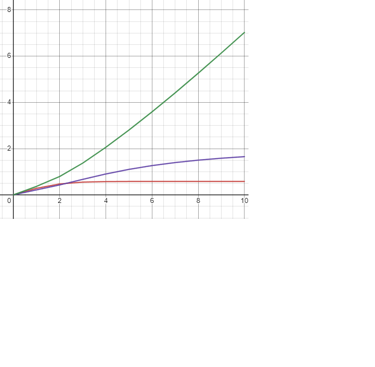

Министерство образования Республики Беларусь

Учреждение образования

“Брестский Государственный технический университет”

Кафедра ИИТ

       

Лабораторная работа №1

По дисциплине “Теория и методы автоматического управления”

Тема: “Моделирования температуры объекта”

     

Выполнил:

Студент 3 курса

Группы АС-63

Кульбеда К.А.

Проверил:

Иванюк Д. С.

     

Брест 2024

---

## Цель работы:
Реализовать программу на языке C++ для моделирования работы ПИД-регулятора. В качестве управляемого объекта использовать математическую модель, разработанную в предыдущей работе. Программа должна быть построена с использованием объектно-ориентированного подхода и включать не менее трех классов с применением механизма наследования. В отчете необходимо предоставить графики, иллюстрирующие изменение температуры объекта в зависимости от заданных параметров, и объяснить полученные результаты.

### Линейная модель

### Нелинейная модель

## Результат работы
Реализована программа на языке C++, моделирующая поведение ПИД-регулятора. Для документирования кода использовался инструмент Doxygen, а затем документация была преобразована в файл формата Markdown (.md). Результаты выполнения программы сохранены в файле results.txt.