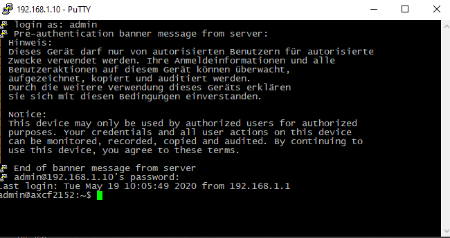
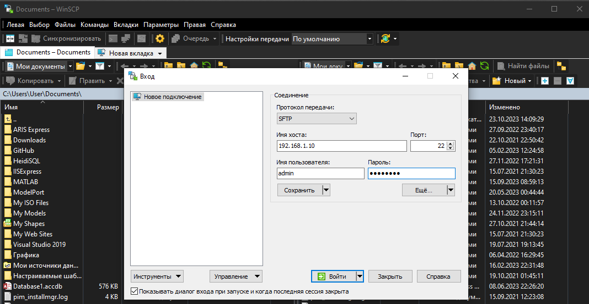

Министерство образования Республики Беларусь

Учреждение образования

“Брестский Государственный технический университет”

Кафедра ИИТ

       

Лабораторная работа №3

По дисциплине “Теория и методы автоматического управления”

Тема: "Работа с контроллером AXC F 2152"

     

Выполнил:

Студент 3 курса

Группы АС-63

Кульбеда К.А.

Проверил:

Иванюк Д. С.

     

Брест 2024

---

## Лабораторная работа №3

### Цель работы

Использовать Visual Studio Code для создания тестового проекта под названием "Hello PLCnext от AS06313!", собрать его и проверить работу на тестовом контроллере.

### Шаги, которые я выполнил:
1. Сначала я клонировал репозиторий "savushkin-r-d/PLCnext-howto" на свой компьютер и собрал исполняемый файл "hello_PLCnext" в Visual Studio Code с использованием CMake.

2. Затем я подключился к контроллеру через LAN-кабель, предварительно настроив соединение через IPV-4. В настройках подключения указал IP-адрес "192.168.1.1" и маску "255.255.255.0".

3. Проверил подключение командой "ping 192.168.1.10" в командной строке, где "192.168.1.10" — это IP-адрес контроллера. Пакеты не терялись, значит, подключение было установлено корректно.

4. Установил на компьютер программы PuTTY и WinSCP, чтобы облегчить взаимодействие с контроллером.

5. Подключился к контроллеру через PuTTY, указав его IP-адрес, логин "admin" и пароль "785*****".

6. С помощью WinSCP перенёс собранный исполняемый файл в корневую директорию контроллера, введя IP-адрес, логин и пароль.

7. Изменил права доступа на контроллере, чтобы запустить исполняемый файл.

8. Запустил файл и убедился, что он работает корректно.

Каждый шаг помог проверить работу тестового проекта "Hello PLCnext" на контроллере.