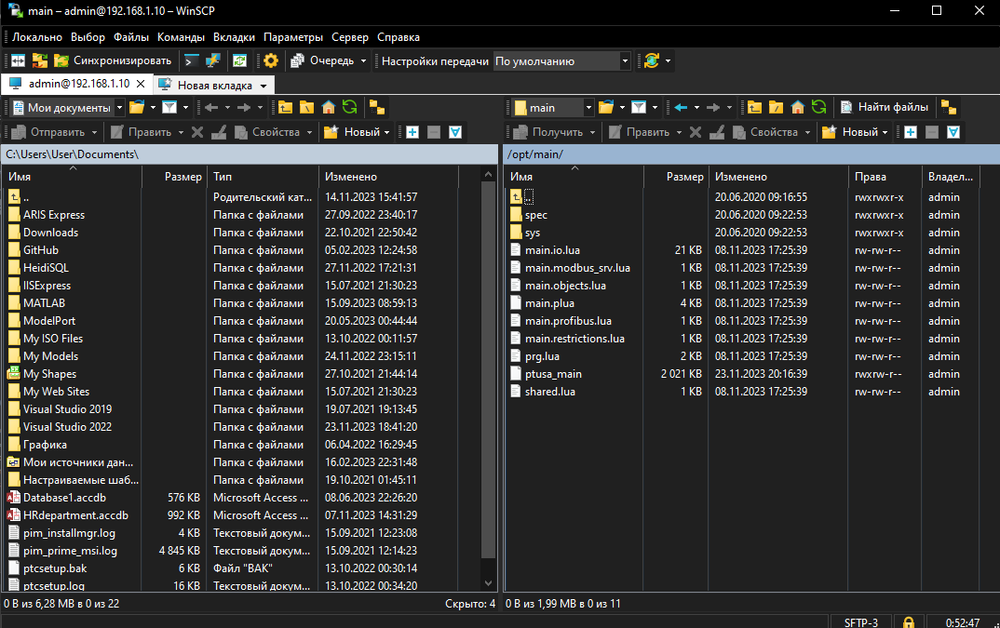
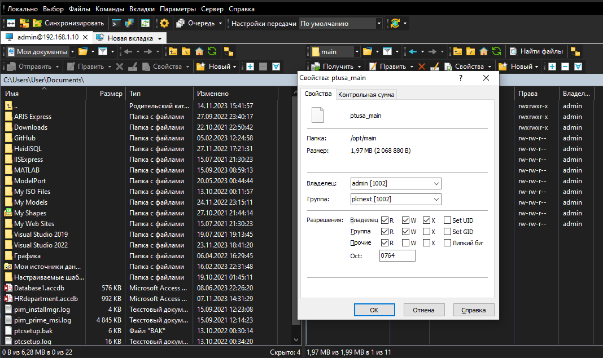
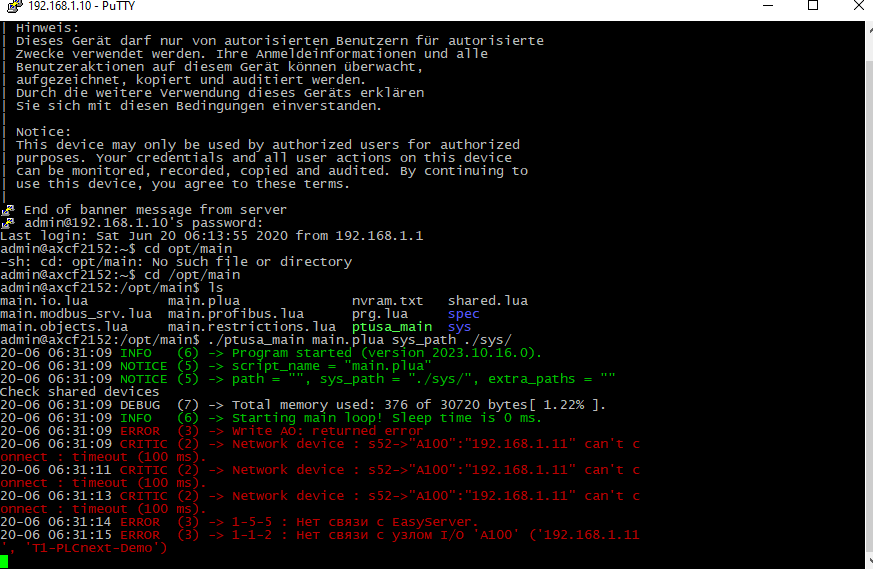

<p align="center">Министерство образования Республики Беларусь</p>
<p align="center">Учреждение образования</p>
<p align="center">“Брестский Государственный технический университет”</p>
<p align="center">Кафедра ИИТ</p>
<br><br><br><br><br><br><br>
<p align="center">Лабораторная работа №4</p>
<p align="center">По дисциплине “Теория и методы автоматического управления”</p>
<p align="center">Тема: "Работа с контроллером AXCF 2152"</p>
<br><br><br><br><br>
<p align="right">Выполнил:</p>
<p align="right">Студент 3 курса</p>
<p align="right">Группы АС-63</p>
<p align="right">Кульбеда К.А.</p>
<p align="right">Проверил:</p>
<p align="right">Иванюк Д. С.</p>
<br><br><br><br><br>
<p align="center">Брест 2024</p>

---

## лабораторная работа №4

### Цель работы

Ознакомиться с основами платформы PLCnext, понять структуру проекта ptusa_main, выполнить его сборку и запустить на тестовом контроллере.

### Шаги, которые я выполнил:

1. Сначала я клонировал репозиторий "savushkin-r-d/ptusa_main" на свой компьютер и собрал исполняемый файл "ptusa_main" в Visual Studio 2022.


2. Затем я выполнил шаги 2-5 из третьей лабораторной работы, перейдя по ссылке:
[as0006313/task_03/doc/README.md](https://github.com/brstu/TMAU-2024/blob/main/trunk/as0006113/task_03/doc/README.md)

3. В корне контроллера я создал директорию, например /opt/main/, и с помощью WinSCP перенёс туда файлы с расширениями .lua и .plua, а также папки spec и sys из проекта T1-PLCnext-Demo и исполняемый файл.



4. Изменил права доступа на запуск исполняемого файла.


5. Запустил файл, используя следующую команду:

```bash
./ptusa_main main.plua sys_path ./sys/
```



Эти действия позволили мне успешно запустить и проверить работу проекта ptusa_main на тестовом контроллере.
