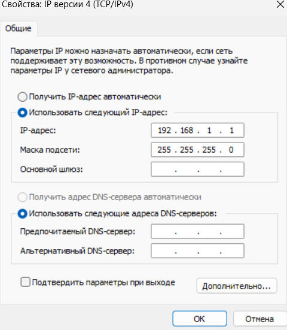
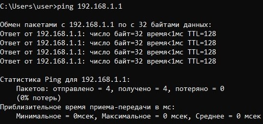
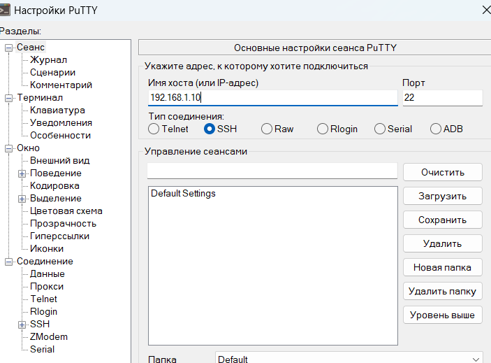
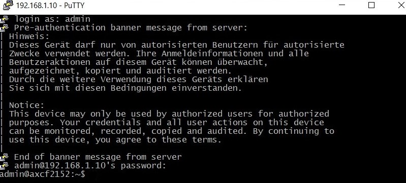
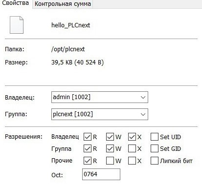
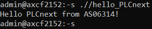

<p align="center">Миниcтepcтвo oбpaзoвaния Pecпyблики Бeлaрycь</p>
<p align="center">Учрeждeниe oбрaзoвaния</p>
<p align="center">«Брecтский гocyдaрcтвeнный тexничecкий yнивepcитeт»</p>
<p align="center">Кaфeдpa ИИТ</p>
<br><br><br><br><br><br><br>
<p align="center">Лaбoрaтopнaя paбoтa №3</p>
<p align="center">Пo диcциплинe «Тeория и мeтoды aвтoмaтичecкoгo yпрaвлeния»</p>
<p align="center">Тeмa: «Рaбoтa c кoнтрoллeрoм АХС F 2152»</p>
<br><br><br><br><br>
<p align="right">Bыпoлнил:</p>
<p align="right">Cтyдeнт 3-гo кypca</p>
<p align="right">Грyппы AC-63</p>
<p align="right">Кухарчук И. Н.</p>
<p align="right">Проверила:</p>
<p align="right">Ситковец Я. С.</p>
<br><br><br><br><br>
<p align="center">Брест 2024</p>

---

## Тестовый проект "Hello PLCnext from AS0xxyy!"

### Цель
Создать и собрать тестовый проект "Hello PLCnext from AS0xxyy!", а затем продемонстрировать его работоспособность на тестовом контроллере.

### Ход работы

#### Этап подготовки

1. **Клонирование репозитория**:
   ```sh
   git clone https://github.com/savushkin-r-d/PLCnext-howto
   ```

2. **Конфигурирование проекта**:
   ```sh
   cmake --preset=build-windows-AXCF2152-2021.0.3.35554 .
   ```

3. **Сборка проекта**:
   ```sh
   cmake --build --preset=build-windows-AXCF2152-2021.0.3.35554 --target all
   ```

4. **Развертывание проекта**:
   ```sh
   cmake --build --preset=build-windows-AXCF2152-2021.0.3.35554 --target install
   ```

После развертывания исполняемый файл можно найти по следующему пути:

> deploy\AXCF2152_21.0.3.35554\Release\bin\hello_PLCnext

#### Этап подключения и настройки

После получения бинарного файла необходимо подключить контроллер к компьютеру и настроить данные сети.


<br>
| _Новое значение IP-адреса версии 4_

Для проверки корректности подключения выполните пинг контроллера с использованием команды `ping 192.168.1.1`.


<br>
| _Результат проверки соединения_

Необходимо ввести имя хоста (в данном случае IP-адрес - `192.168.1.10`), а также войти в систему __PuTTY Configuration__, используя логин __Admin__ и пароль, нанесённый на контроллере.


<br>
| _Окно настройки PuTTY_


<br>
| _Успешный вход в систему_

После установки соединения с контроллером, вводя те же данные, нужно авторизироваться и настроить __WinSCP__, чтобы в дальнейшем перенести бинарный файл на контроллер.


<br>
| _Окно WinSCP с введенными данными_

Теперь необходимо переместить бинарный файл hello_PLCnext на контроллер и изменить его свойства, делая его исполняемым.


<br>
| _Информация о бинарном файле_

#### Этап запуска программы

Теперь можно запустить исполняемый файл командой `./hello_PLCnext`.


<br>
| _Результат работы программы_

### Заключение
Проект успешно создан, собран и проверен на тестовом контроллере. Результат работы программы отображается корректно.
