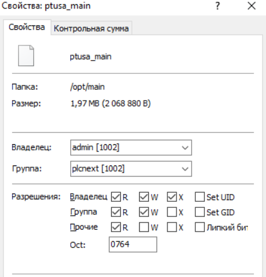
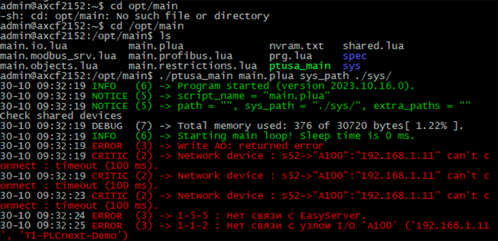

<p align="center">Министерство образования Республики Беларусь</p>
<p align="center">Учреждение образования</p>
<p align="center">«Брестский государственный технический университет»</p>
<p align="center">Кафедра ИИТ</p>
<br><br><br><br><br><br><br>
<p align="center">Лабораторная работа №4</p>
<p align="center">По дисциплине «Теория и методы автоматического управления»</p>
<p align="center">Тема: «Работа с контроллером AXC F 2152»</p>
<br><br><br><br><br>
<p align="right">Выполнил:</p>
<p align="right">Студент 3-го курса</p>
<p align="right">Группы АС-63</p>
<p align="right">Кухарчук И.Н.</p>
<p align="right">Проверила:</p>
<p align="right">Ситковец Я. С.</p>
<br><br><br><br><br>
<p align="center">Брест 2024</p>

---
## Задание:
Используя Visual Studio собрать проект `ptusa_main` и продемонстрировать его работоспособность на тестовом контроллере.

## Ход работы

### Подготовка

1. **Клонирование репозитория**:
   ```sh
   git clone --recurse-submodules https://github.com/savushkin-r-d/ptusa_main
   ```

   > В связи с большим размером проекта, перед клонированием репозитория необходимо увеличить буфер для Git командой:
   ```sh
   git config --global http.postBuffer 524288000
   ```

2. **Загрузка и установка PLCnext Technology C++ Toolchain**:
   - Загрузить последнюю версию `PLCnext Technology C++ Toolchain` (версии 2023.0 LTS) с веб-сайта [Phoenix Contact](https://www.phoenixcontact.com) -> [phoenixcontact.com](https://www.phoenixcontact.com/ru-lt/produkty/kontroller-axc-f-2152-2404267#downloads-link-target).

   - Установить `PLCnext Technology C++ Toolchain` через `Visual Studio Installer`, предварительно установив рабочую нагрузку **.NET desktop development**.

3. **Загрузка и установка SDK**:
   - Загрузить `SDK` -> [phoenixcontact.com](https://www.phoenixcontact.com/ru-lt/produkty/kontroller-axc-f-2152-2404267?type=softw).

   - Установить `SDK` с помощью команды:
     ```sh
     plcncli.exe install sdk –d [путь установки] –p [путь к архивному файлу]
     ```
     Пример:
     ```sh
     plcncli.exe install sdk –d C:\CLI\sdks\AXCF2152\ –p C:\Users\kseni\Downloads\SDK_for_Windows_64_V_2022_6\pxc-glibc-x86_64-mingw32-axcf2152-image-mingw-cortexa9t2hf-neon-axcf2152-toolchain-2022.6.tar.xz
     ```

### Сборка проекта

Теперь можно приступать к сборке проекта в Microsoft Visual Studio Community 2022. Выберите элемент запуска `ptusa_main.exe`.

### Подключение и настройка

Далее необходимо следовать инструкциям из главы **`Этап подключения и настройки`** в [Лабораторной работе №3](../../task_03/doc/readme.md) до момента успешного входа в систему.

После этого необходимо создать каталог в корневом каталоге контроллера, например `/opt/main/`, и перенести файлы с расширениями `.lua` и `.plua`, каталоги `spec` и `sys` из проекта `T1-PLCnext-Demo`, а также исполняемый файл на контроллер с помощью программы `WinSCP`.


<br>
| _Изменённые права доступа файла `ptusa_main`_

### Запуск программы

Для того, чтобы запустить программу, необходимо выполнить команду:
```sh
./ptusa_main main.plua sys_path ./sys/
```


<br>
| _Вывод программы_

### Заключение
Проект успешно собран и проверен на тестовом контроллере. Результат работы программы отображается корректно.