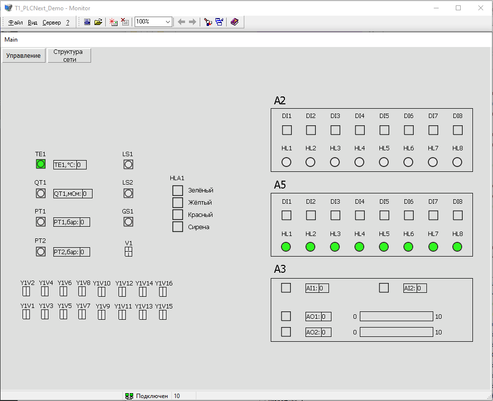

<p align="center">Министерство образования Республики Беларусь</p>
<p align="center">Учреждение образования</p>
<p align="center">«Брестский государственный технический университет»</p>
<p align="center">Кафедра ИИТ</p>
<br><br><br><br><br><br><br>
<p align="center">Лабораторная работа №5</p>
<p align="center">По дисциплине «Теория и методы автоматического управления»</p>
<p align="center">Тема: «Работа с контроллером AXC F 2152»</p>
<br><br><br><br><br>
<p align="right">Выполнил:</p>
<p align="right">Студент 3-го курса</p>
<p align="right">Группы АС-63</p>
<p align="right">Кухарчук И.Н.</p>
<p align="right">Проверила:</p>
<p align="right">Ситковец Я. С.</p>
<br><br><br><br><br>
<p align="center">Брест 2024</p>

---
# Задание:
Развернуть проект **T1-PLCnext-Demo** локально и на тестовом контроллере и продемонстрировать работу. Также внести изменения в описание управляющей программы.

# Ход работы

## Развернуть проект **T1-PLCnext-Demo** локально

### Подготовка

1. **Клонирование репозитория**:
   ```sh
   git clone --recurse-submodules https://github.com/savushkin-r-d/T1-PLCnext-Demo
   ```

2. **Установка Git LFS**:
   - Скачать и установить последнюю версию приложения [Git LFS](https://git-lfs.com/).

3. **Клонирование репозитория с компонентами**:
   ```sh
   git clone --recurse-submodules https://github.com/savushkin-r-d/SCADA-ptusa-bin
   ```

4. **Настройка DbEditorXML**:
   - Запустить **DbEditorXML.exe**.
   - Добавить драйвер *T1_PLCNext_Demo.cdbx*.
   - Убедиться, что IP-адрес установлен на `127.0.0.1`.
   - Запустить **Bugger.exe** для проверки корректности загрузки сервера.

5. **Настройка EasyServer**:
   - Запустить **EasyServer** из клонированного репозитория.
   - Следуя [инструкции](https://github.com/savushkin-r-d/T1-PLCnext-Demo?tab=readme-ov-file#клонирование-проекта), настроить файл.
   - Запустить проект по адресу (в моем случае): `"C:\Users\kseni\Documents\GitHub\SCADA-ptusa-bin\projects\T1_PLCNext_Demo.mpr"`.

6. **Настройка Monitor**:
   - Запустить **Monitor.exe**.
   - В меню проектов добавить файл *T1_PLCNext_Demo.mpr*.
   - Открыть проект с данными `Имя пользователя` - `user` и `Сервер` - `localhost`.

### Сборка и запуск

1. **Тестирование проекта**:
   - В меню сверху выбрать "Файл" -> "Открыть рабочую область из файла" -> "Выбрать файл рабочей области: (D:\PTUSA-projects\T1_PLCNext_Demo\project.code-workspace)".
   - Запустить **EasyServer** и **Monitor**.
   - Запустить проект в _Visual Studio Code_.

2. **Проверка работы**:
   - В **Monitor** будут видны все устройства проекта тестового стенда *T1_PLCNext_Demo* с возможностью управления.


<br>
| _Monitor_

## Запуск на контроллере

Для запуска на контроллере необходим файл _ptusa_main_ - результат [Лабораторной работы №4](../../task_04/doc/readme.md). Там же указана инструкция для сборки и подключения.

## Измененный файл `main.plua`

```lua
-- Проект 'T1-PLCnext-Demo'

prg = require("prg")                        -- Технологические объекты.
require("sharedmodbus")                     -- Межконтроллерный обмен
------------------------------------------------------------------------------
------------------------------------------------------------------------------
-- Пользовательская функция инициализации, выполняемая однократно в PAC.

A5HL1_info = { lamp = A5HL1 }
A5HL2_info = { lamp = A5HL2 }
A5HL3_info = { lamp = A5HL3 }
A5HL4_info = { lamp = A5HL4 }
A5HL5_info = { lamp = A5HL5 }
A5HL6_info = { lamp = A5HL6 }
A5HL7_info = { lamp = A5HL7 }
A5HL8_info = { lamp = A5HL8 }

function user_init()
    local delay = 5000
    local interval = 200

    A5HL1_info.start_time = get_millisec()
    A5HL2_info.start_time = A5HL1_info.start_time - interval
    A5HL3_info.start_time = A5HL2_info.start_time - interval
    A5HL4_info.start_time = A5HL3_info.start_time - interval
    A5HL5_info.start_time = A5HL4_info.start_time - interval
    A5HL6_info.start_time = A5HL5_info.start_time - interval
    A5HL7_info.start_time = A5HL6_info.start_time - interval
    A5HL8_info.start_time = A5HL7_info.start_time - interval
end

function blink(info)
    if get_delta_millisec(info.start_time) > 2000 then
        if info.lamp:get_state() == 1 then info.lamp:set_state(0) else info.lamp:set_state(1) end
        info.start_time = get_millisec()
    end
end
------------------------------------------------------------------------------
------------------------------------------------------------------------------
-- Пользовательская функция, выполняемая каждый цикл в PAC.

function user_eval()
    A2HL1:set_state(A2DI1:get_state())
    A2HL2:set_state(A2DI2:get_state())
    A2HL3:set_state(A2DI3:get_state())
    A2HL4:set_state(A2DI4:get_state())
    A2HL5:set_state(A2DI5:get_state())
    A2HL6:set_state(A2DI6:get_state())
    A2HL7:set_state(A2DI7:get_state())
    A2HL8:set_state(A2DI8:get_state())

    A3AO1:set_value(A3AI1:get_value())

    blink(A5HL1_info)
    blink(A5HL2_info)
    blink(A5HL3_info)
    blink(A5HL4_info)
    blink(A5HL5_info)
    blink(A5HL6_info)
    blink(A5HL7_info)
    blink(A5HL8_info)

    local GREEN_MIN = 0.3
    local YELLOW_MIN = 3
    local RED_MIN = 6

    if A3AI1:get_value() < GREEN_MIN then
        HLA1:off()
    elseif A3AI1:get_value() >= GREEN_MIN and A3AI1:get_value() < YELLOW_MIN then
        HLA1:turn_off_red()
        HLA1:turn_off_yellow()
        HLA1:normal_blink_green()
    elseif A3AI1:get_value() >= YELLOW_MIN and A3AI1:get_value() < RED_MIN then
        HLA1:off()
        HLA1:turn_on_yellow()
    elseif A3AI1:get_value() >= RED_MIN then
        HLA1:off()
        HLA1:turn_on_red()
    end
end
------------------------------------------------------------------------------
------------------------------------------------------------------------------
-- Функция инициализации параметров, выполняемая однократно в PAC.

function user_init_params()
end
------------------------------------------------------------------------------
------------------------------------------------------------------------------
```

## Описание изменения

### 1. Переименование переменной `delta` в `interval`

```lua
local interval = 200
```

**Изменение**: Переменная `delta` была переименована в `interval` для улучшения читаемости кода.

**Причина**: Переименование переменной делает код более понятным и интуитивно понятным. Вместо того чтобы думать о том, что означает `delta`, разработчики могут сразу понять, что `interval` представляет собой интервал времени между событиями. Это улучшает читаемость и поддерживаемость кода.

**Результат**: Код становится более понятным и легким для понимания, что упрощает дальнейшую разработку и отладку.

### Заключение
Проект успешно развернут и проверен на тестовом контроллере. Результат работы программы отображается корректно.