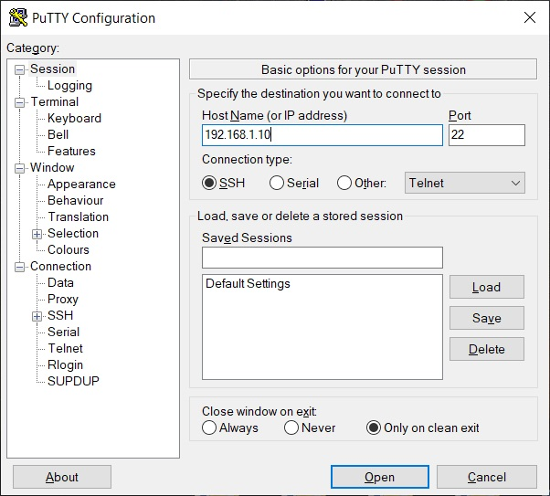

<p align="center">Министерство Образования Республики Беларусь</p>
<p align="center">Учреждение образования</p>
<p align="center">«Брестский Государственный Технический Университет»</p>       
<p align="center">Кафедра ИИТ</p>
<br><br><br><br>
<p align="center">Лабораторная работа №3</p>
<br><br><br>
<p align="right">Выполнил студент 3 курса</p> 
<p align="right">Факультета Электронных Информационных Систем</p>
<p align="right">Группы АС-63 Мороз Е. В.</p>
<p align="right">Проверила Ситковец Я. С.</p>
<br><br><br>
<p align="center">Брест 2024</p>

---
<p> <strong>Цель:</strong> создать тестовый проект "Hello PLCnext from AS0xxyy!", собрать его и запустить на тестовом контроллере для подтверждения работоспособности.</p> 

<p> <strong>Решение:</strong> </p>
<p>Клонируем репозиторий проекта.</p>
<p>После чего собираем файл <em>hello_PLCnext</em> с помощью следующих команд:</p>


 ``` bash
cmake --preset=build-windows-AXCF2152-2021.0.3.35554 .
```


 ``` bash
cmake --build --preset=build-windows-AXCF2152-2021.0.3.35554 --target all
```


 ``` bash
cmake --build --preset=build-windows-AXCF2152-2021.0.3.35554 --target install
```

<p>Устанавливаем сетевое подключение с контроллером.</p>


<p>Проверяем соединение с контроллером.</p>


<p>Открываем <em>PuTTY Configuration</em> и подключаемся к контроллеру.</p>



<p>Авторизуемся на контроллере, вводим логин и пароль.</p>


<p>С помощью <em>WinCP</em> подключаемся к контроллеру.</p>


<p>Загружаем собранный проект и настраиваем разрешения для его запуска.</p>


<p>Запускаем проект:</p>


<p> <strong> Вывод:</strong> В процессе лабораторной работы был разработан тестовый проект "Hello PLCnext from AS06316!", что способствовало приобретению навыков работы с контроллером <em>AXC F 2152</em>.</p>