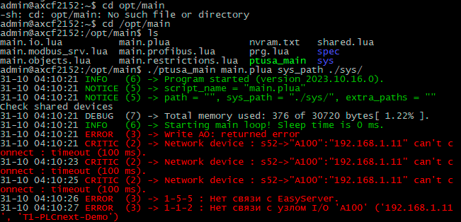

<p align="center">Министерство Образования Республики Беларусь</p>
<p align="center">Учреждение образования</p>
<p align="center">«Брестский Государственный Технический Университет»</p>       
<p align="center">Кафедра ИИТ</p>
<br><br><br><br>
<p align="center">Лабораторная работа №4</p>
<br><br><br>
<p align="right">Выполнил студент 3 курса</p> 
<p align="right">Факультета Электронных Информационных Систем</p>
<p align="right">Группы АС-63 Мороз Е. В.</p>
<p align="right">Проверила Ситковец Я. С.</p>
<br><br><br>
<p align="center">Брест 2024</p>

---
<p> <strong>Цель:</strong> собрать прокт ptusa_main и продемонстрировать работоспособность на тестовом контроллере.</p>

<p>Для решения поставленной задачи, для начала необходимо собрать файл <em>ptusa_main</em> в Visual Studio. Чтобы собрать файл для начала необходимо клонировать репозиторий, для этого используются следующая команда:</p>

 ``` bash
git clone --recurse-submodules https://github.com/savushkin-r-d/ptusa_main.git
```

<p>После клонирования репозитория собираем проект.</p>

<p>В результате сборки получаем файл <em>ptusa_main</em>.</p>

<p>Собрав исполняемый файл, подключаемся к контроллеру через Ethernet-соединение.</p>

<p>После подключения и проверки запускаем исполняемый файл.</p>

<p align="center">