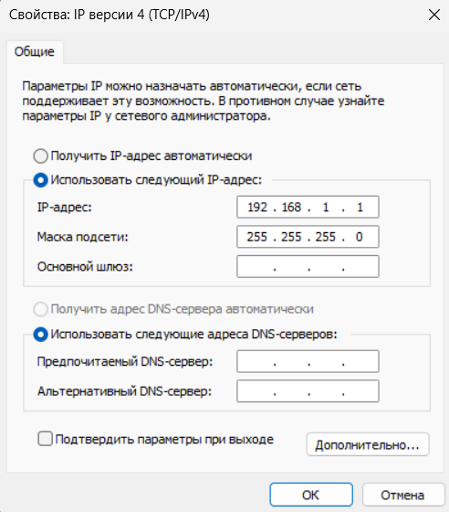
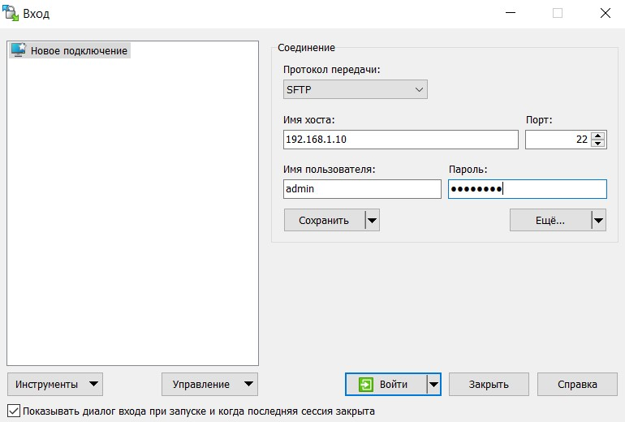

<p align="center">Министерство образования Республики Беларусь</p>
<p align="center">Учреждение образования</p>
<p align="center">«Брестский государственный технический университет»</p>
<p align="center">Кафедра ИИТ</p>
<br><br><br><br><br><br><br>
<p align="center">Лабораторная работа №3</p>
<p align="center">По дисциплине «Теория и методы автоматического управления»</p>
<p align="center">Тема: «Работа с контроллером AXC F 2152»</p>
<br><br><br><br><br>
<p align="right">Выполнил:</p>
<p align="right">Студент 3-го курса</p>
<p align="right">Группы АС-63</p>
<p align="right">Cавко П.С.</p>
<p align="right">Проверила:</p>
<p align="right">Ситковец Я. С.</p>
<br><br><br><br><br>
<p align="center">Брест 2024</p>

---

## Task:
Using Visual Studio Code, create a test project titled "Hello PLCnext from AS0xxyy!", compile it, and demonstrate its functionality on a test controller.

## Process

### Preparation Stage

To create and compile the test project, follow these steps:
1. Clone the repository:
``` sh
git clone https://github.com/savushkin-r-d/PLCnext-howto
```
2. Configuration: 
``` sh
cmake --preset=build-windows-AXCF2152-2021.0.3.35554 .
```
3. Compilation:
``` sh
cmake --build --preset=build-windows-AXCF2152-2021.0.3.35554 --target all
```
4. Deployment:
``` sh
cmake --build --preset=build-windows-AXCF2152-2021.0.3.35554 --target install
```

After deployment, the executable file can be found at the following path:

> deploy\AXCF2152_21.0.3.35554\Release\bin\hello_PLCnext

### Connection and Configuration Stage

After obtaining the binary file, connect the controller to the computer and configure the network settings.


<br>
| _New IPv4 Address Value_

To verify the connection, you need to ping the controller using the command ping 192.168.1.1.


<br>
| _Connection Test Result _

You need to enter the hostname (in this case, the IP address - 192.168.1.10), and then log in to PuTTY Configuration using the username Admin and the password printed on the controller.


<br>
| _PuTTY Configuration Window_


<br>
| _Successful Login_

After establishing a connection with the controller, use the same credentials to log in and configure WinSCP to transfer the binary file to the controller later.


<br>
| _WinSCP Window with Entered Credentials_

Now, you need to transfer the binary file hello_PLCnext to the controller and modify its properties to make it executable.

 
 <br>
 | _Binary File Information_

### Program Launch Stage

You can now run the executable file using the command ./hello_PLCnext.


<br>
| _Program Output Result_
