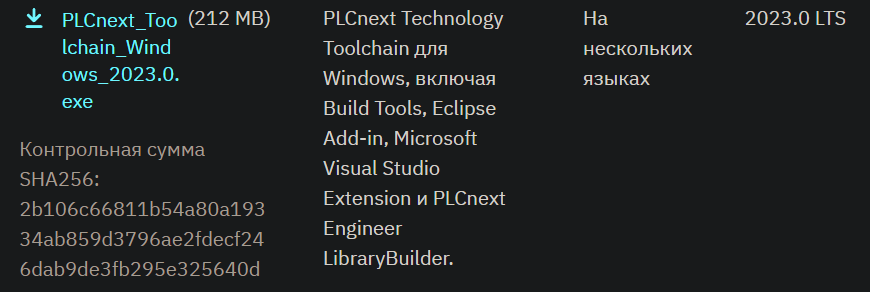

<p align="center">Министерство образования Республики Беларусь</p>
<p align="center">Учреждение образования</p>
<p align="center">«Брестский государственный технический университет»</p>
<p align="center">Кафедра ИИТ</p>
<br><br><br><br><br><br><br>
<p align="center">Лабораторная работа №4</p>
<p align="center">По дисциплине «Теория и методы автоматического управления»</p>
<p align="center">Тема: «Работа с контроллером AXC F 2152»</p>
<br><br><br><br><br>
<p align="right">Выполнил:</p>
<p align="right">Студент 3-го курса</p>
<p align="right">Группы АС-63</p>
<p align="right">Cавко П.С.</p>
<p align="right">Проверила:</p>
<p align="right">Ситковец Я. С.</p>
<br><br><br><br><br>
<p align="center">Брест 2024</p>

---

## Task
Compile the ptusa_main project in Visual Studio and demonstrate its functionality on a test controller.

## Process

### Preparation

1. Clone the repository:
``` sh
git clone --recurse-submodules https://github.com/savushkin-r-d/ptusa_main
```

>Before cloning the repository, increase the buffer for Git by executing the command: git config --global http.postBuffer 524288000.`

2. Download the latest version of the PLCnext Technology C++ Toolchain (2023.0 LTS) from the Phoenix Contact website.
 [Phoenix Contact](https://www.phoenixcontact.com) -> [phoenixcontact.com](https://www.phoenixcontact.com/ru-lt/produkty/kontroller-axc-f-2152-2404267#downloads-link-target).


<br>
| _PLCnext for ОС Windows_

4. In the Visual Studio Installer, install the .NET desktop development workload, after which you can install the PLCnext Technology C++ Toolchain

5. Download the SDK from Phoenix -> [phoenixcontact.com](https://www.phoenixcontact.com/ru-lt/produkty/kontroller-axc-f-2152-2404267?type=softw).


<br>
| _SDK for ОС Windows_

7. After that, you should install the SDK using the following command:
```sh
plcncli.exe install sdk –d [путь установки] –p [путь к архивному файлу]
```
In my case, the command is as follows:
```sh
plcncli.exe install sdk –d C:\CLI\sdks\AXCF2152\ –p C:\Users\kseni\Downloads\SDK_for_Windows_64_V_2022_6\pxc-glibc-x86_64-mingw32-axcf2152-image-mingw-cortexa9t2hf-neon-axcf2152-toolchain-2022.6.tar.xz
```

### Project Compilation
Now you can proceed with compiling the project in Microsoft Visual Studio Community 2022 by selecting Launch Item -> ptusa_main.exe.

###Connection and Configuration
Next, follow the section Connection and Configuration Stage in Laboratory Work No. 3 until you successfully log in.

After that, create a directory in the root of the controller, for example, /opt/main/, and transfer the files with the extensions .lua and .plua, as well as the spec and sys directories from the T1-PLCnext-Demo project and the executable file to the controller using WinSCP.


<br>
| _Changed file permissions for ptusa_main_

### Program Launch

To run the program, execute the following command:
```sh
./ptusa_main  main.plua  sys_path ./sys/
```


<br>
| _Program Output_
