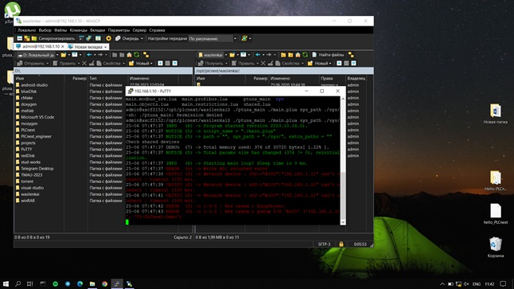

<p align="center"> Министерство образования Республики Беларусь</p>
<p align="center">Учреждение образования</p>
<p align="center">“Брестский Государственный технический университет”</p>
<p align="center">Кафедра ИИТ</p>
<br><br><br>
<p align="center">Лабораторная работа №4</p>
<p align="center">По дисциплине “Теория и методы автоматического управления”</p>
<p align="center">Тема: “Работа с контроллером AXC F 2152”</p>
<br><br><br>
<p align="right"><strong>Выполнил:</strong></p>
<p align="right">Студент 3 курса</p>
<p align="right">Группы АС-63</p>
<p align="right">Соколова М. А.</p>
<br>
<p align="right"><strong>Проверила:</strong></p>
<p align="right">Ситковец Я. С.</p>
<br><br><br>
<p align="center">Брест 2024</p>

---
<p> <strong>Цель: </strong>используя <em>Visual Studio</em> собрать данный проект и продемонстрировать работоспособность на тестовом контроллере.</p> 

Задание: [#4](../../../../tasks/task_04/readme.md).
<p> <strong>Решение:</strong> </p>
<ul>
<li>По заданию лабораторной работы №4, клонируем репозиторий [ptusa_main](https://github.com/savushkin-r-d/ptusa_main).</li>
<li><p>Открываем данный репозиторий (в <em>Visual Studio</em>). Таким образом, мы получаем проект на основе <em>CMake</em>.</p></li>
<li><p>Используя <em>Visual Studio</em> собраем данный проект.</p></li>
<li><p>Далее подключаемся к тестовому контроллеру <em>AXC F 2152</em> в лаборатории так же как и в <em>3 лабораторной работе:</em> </p></li>

[task_03](../../task_03/doc/readme.md).

<li><p>Переходим в папку с проектом, предварительно переместив её на контроллер, и запускаем нашу программу:</p></li>

``` bash

./ptusa_main  main.plua  sys_path  ./sys/

```

<li><p>Получаем следующий вывод нашей программы на консоль: </p></li>

</ul>




<p> <strong> Вывод:</strong> В ходе выполнения данной лабораторной работы мы получили ценный опыт работы с <em>Visual Studio</em> и контроллером <em>AXC F 2152</em>, что является важным шагом в освоении навыков программирования и работы с автоматизированными системами. Дополнительно к этому, можно отметить, что такие практические занятия позволяют не только закрепить теоретические знания, но и развить способность к решению реальных технических задач, что является ключевым аспектом инженерной деятельности.
<p>Работа с <em>AXC F 2152</em> открывает перед нами возможности для создания масштабируемых и гибких систем автоматизации. Это устройство, благодаря своей мощности и многофункциональности, позволяет реализовывать сложные проекты в области промышленной автоматизации. Наши новые навыки работы с этим контроллером могут быть применены в различных проектах, начиная от простых задач мониторинга и управления, и заканчивая сложными системами, требующими интеграции с другими устройствами и сервисами.</p>
<p>Также мы продолжили исследование возможностей, которые предоставляет среда разработки Visual Studio, так как она является одной из ведущих платформ для разработки программного обеспечения. Освоение дополнительных функций и инструментов этой среды позволит нам повысить эффективность разработки и качество конечного продукта.</p>
