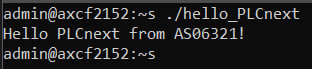

<p align="center">Министерство образования Республики Беларусь</p>
<p align="center">Учреждение образования</p>
<p align="center">“Брестский Государственный технический университет”</p>
<p align="center">Кафедра ИИТ</p>
<br><br><br><br><br><br>
<p align="center"><strong>Лабораторная работа №3</strong></p>
<p align="center"><strong>По дисциплине</strong> “Теория и методы автоматического управления”</p>
<p align="center"><strong>Тема:</strong> “Работа с контроллером AXC F 2152”</p>
<br><br><br><br><br><br>
<p align="right"><strong>Выполнил</strong>:</p>
<p align="right">Студент 3 курса</p>
<p align="right">Группы АС-63</p>
<p align="right">Стельмашук И.А.</p>
<p align="right"><strong>Проверил:</strong></p>
<p align="right">Иванюк Д. С.</p>
<br><br><br><br><br>
<p align="center"><strong>Брест 2024</strong></p>

---
<p><strong>Цель:</strong> разработать тестовый проект "Hello PLCnext from AS0xxyy!", собрать его и протестировать на контроллере для подтверждения его функционирования.</p>

<p><strong>Решение:</strong></p>
<p>Согласно заданию, начинаем с клонирования репозитория проекта.</p>
<p>Собираем файл <em>hello_PLCnext</em> с использованием следующих команд:</p>

```bash
cmake --preset=build-windows-AXCF2152-2021.0.3.35554 .

```bash
cmake --build --preset=build-windows-AXCF2152-2021.0.3.35554 --target all

```bash
cmake --build --preset=build-windows-AXCF2152-2021.0.3.35554 --target install

<p>Устанавливаем сетевое подключение к контроллеру.</p>

  

<p>Проверяем соединение с контроллером.</p>

  

<p>Открываем <em>PuTTY Configuration</em> и подключаемся к контроллеру.</p>

 

<p>Авторизуемся на контроллере, вводя логин и пароль.</p>

 

<p>С помощью <em>WinCP</em> подключаемся к контроллеру.</p>

 

<p>Загружаем собранный проект в корневую директорию контроллера и настраиваем разрешения для его запуска.</p>

 

<p>Запускаем проект и наблюдаем следующий результат:</p>

 

<p><strong>Вывод:</strong> В ходе лабораторной работы был создан тестовый проект "Hello PLCnext from AS0xxyy!" и получены навыки работы с контроллером <em>AXC F 2152</em>.</p>