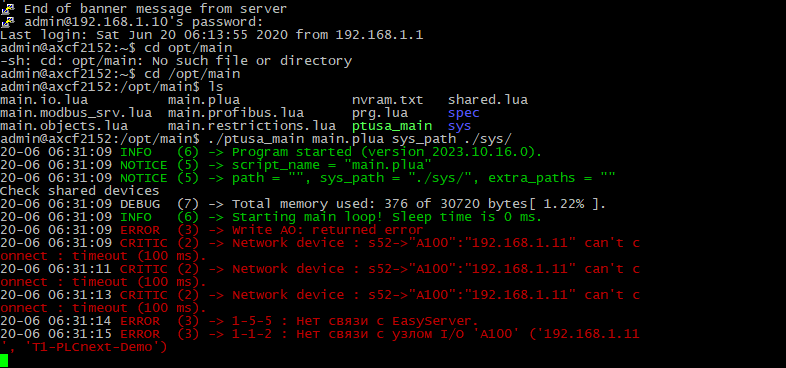

<p align="center">Министерство образования Республики Беларусь</p>
<p align="center">Учреждение образования</p>
<p align="center">“Брестский Государственный технический университет”</p>
<p align="center">Кафедра ИИТ</p>
<br><br><br><br><br><br>
<p align="center"><strong>Лабораторная работа №4</strong></p>
<p align="center"><strong>По дисциплине</strong> “Теория и методы автоматического управления”</p>
<p align="center"><strong>Тема:</strong> “Работа с контроллером AXC F 2152”</p>
<br><br><br><br><br><br>
<p align="right"><strong>Выполнил</strong>:</p>
<p align="right">Студент 3 курса</p>
<p align="right">Группы АС-63</p>
<p align="right">Стельмашук И.А.</p>
<p align="right"><strong>Проверил:</strong></p>
<p align="right">Иванюк Д. С.</p>
<br><br><br><br><br>
<p align="center"><strong>Брест 2024</strong></p>

---
<p> <strong>Цель:</strong> собрать прокт ptusa_main и продемонстрировать работоспособность на тестовом контроллере.</p>

<p>Клонируем репозиторий:</p>

 ``` bash
git clone --recurse-submodules https://github.com/savushkin-r-d/ptusa_main.git
```

<p>Собираем проект.</p>

<p>Получаем файл <em>ptusa_main</em>.</p>

<p>Подключаемся к контроллеру через Ithernet соединение.</p>

<p>Запускаем исполняемый файл.</p>

<p align="center">