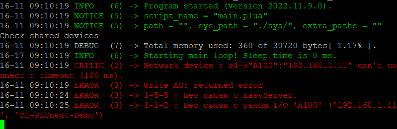

<p align="center"> Министерство образования Республики Беларусь</p>
<p align="center">Учреждение образования</p>
<p align="center">“Брестский Государственный технический университет”</p>
<p align="center">Кафедра ИИТ</p>
<br><br><br>
<p align="center">Лабораторная работа №4</p>
<p align="center">По дисциплине “Теория и методы автоматического управления”</p>
<p align="center">Тема: “Работа с контроллером”</p>
<br><br><br>
<p align="right">Выполнил:</p>
<p align="right">Студент 3 курса</p>
<p align="right">Группы АС-63</p>
<p align="right">Филипчук Д. В.</p>
<p align="right">Проверила:</p>
<p align="right">Ситковец Я. С.</p>
<br><br><br>
<p align="center">Брест 2024</p>

---

## Task 4. Работа с контроллером AXC F 2152:

Используем Visual Studio для сборки проекта ptusa_main и демонстрации его производительности на тестовом контроллере.

### Steps to run:
1. Склонируем репозиторий «savushkin-r-d/ptusa_main» на свой компьютер и создадим исполняемый файл «ptusa_main» в Visual Studio 2022.

2. Далее  выполняем шаги 2-5 третьей лабораторной работы, по ссылке -> [readme.md](../task_03/doc/readme.md)

3. Создаем директорю в корне контроллера, например, /opt/main/, и передачи файлов с расширениями .lua и .plua, а также директорий spec и sys из проекта T1-PLCnext-Demo и исполняемого файла на контроллер с использованием программы WinSCP.

<p align="center">

4. Изменяем права доступа для запуска исполняемого файла.

5. Запускаем исполняемый файл с использованием следующей команды:

```bash
./ptusa_main  main.plua  sys_path ./sys/
```

<p align="center">
