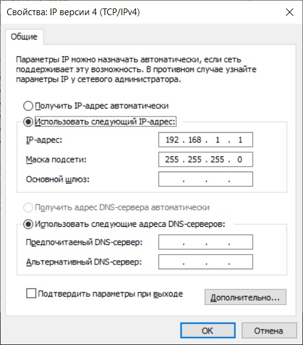
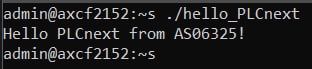

<p align="center">Министерство образования Республики Беларусь</p>
<p align="center">Учреждение образования</p>
<p align="center">“Брестский Государственный технический университет”</p>
<p align="center">Кафедра ИИТ</p>
<br><br><br><br><br><br>
<p align="center"><strong>Лабораторная работа №3</strong></p>
<p align="center"><strong>По дисциплине</strong> “Теория и методы автоматического управления”</p>
<p align="center"><strong>Тема:</strong> “Работа с контроллером AXC F 2152”</p>
<br><br><br><br><br><br>
<p align="right"><strong>Выполнил</strong>:</p>
<p align="right">Студент 3 курса</p>
<p align="right">Группы АС-63</p>
<p align="right">Ярмола А.О.</p>
<p align="right"><strong>Проверил:</strong></p>
<p align="right">Иванюк Д. С.</p>
<br><br><br><br><br>
<p align="center"><strong>Брест 2024</strong></p>

---
<p> <strong>Цель:</strong> создать тестовый проект "Hello PLCnext from AS0xxyy!", собрать его и запустить на тестовом контроллере для подтверждения работоспособности.</p> 

<p> <strong>Решение:</strong> </p>
<p>В соответствии с заданием клонируем репозиторий проекта.</p>
<p>Собираем файл <em>hello_PLCnext</em> с помощью следующих команд:</p>


 ``` bash
cmake --preset=build-windows-AXCF2152-2021.0.3.35554 .
```


 ``` bash
cmake --build --preset=build-windows-AXCF2152-2021.0.3.35554 --target all
```


 ``` bash
cmake --build --preset=build-windows-AXCF2152-2021.0.3.35554 --target install
```

<p>Устанавливаем сетевое подключение с контроллером.</p>

  

<p>Проверяем соединение с контроллером.</p>

  

<p>Открываем <em>PuTTY Configuration</em> и подключаемся к контроллеру.</p>

 

<p>Авторизуемся на контроллере, вводя логин и пароль.</p>

 

<p>С помощью <em>WinCP</em> подключаемся к контроллеру.</p>

 

<p>Загружаем собранный проект в корневую директорию контроллера и настраиваем разрешения для его запуска.</p>

 

<p>Запускаем проект и видим следующий результат:</p>

 

<p> <strong> Вывод:</strong> В ходе лабораторной работы был создан тестовый проект "Hello PLCnext from AS0xxyy!" и приобретены навыки взаимодействия с контроллером <em>AXC F 2152</em>.</p>