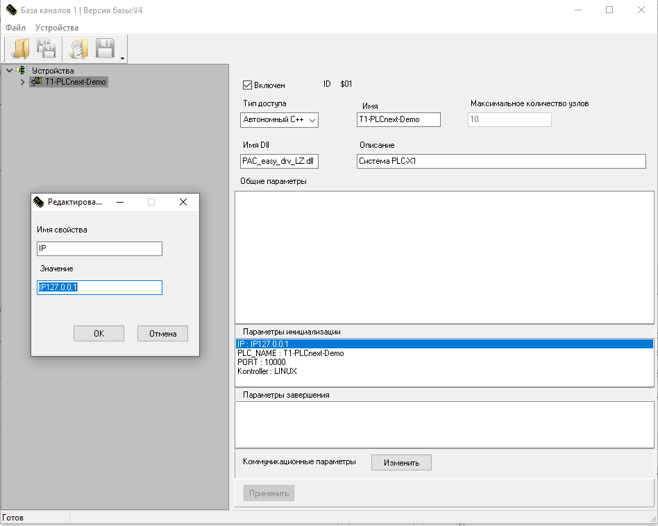
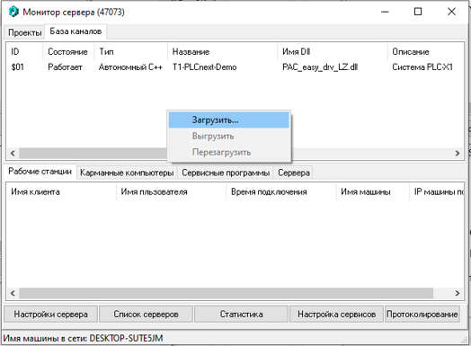

<p align="center">Министерство образования Республики Беларусь</p>
<p align="center">Учреждение образования</p>
<p align="center">“Брестский Государственный технический университет”</p>
<p align="center">Кафедра ИИТ</p>
<br><br><br><br><br><br>
<p align="center"><strong>Лабораторная работа №5</strong></p>
<p align="center"><strong>По дисциплине</strong> “Теория и методы автоматического управления”</p>
<p align="center"><strong>Тема:</strong> “Работа с контроллером AXC F 2152”</p>
<br><br><br><br><br><br>
<p align="right"><strong>Выполнил</strong>:</p>
<p align="right">Студент 3 курса</p>
<p align="right">Группы АС-63</p>
<p align="right">Ярмола А.О.</p>
<p align="right"><strong>Проверил:</strong></p>
<p align="right">Ситковец Я. С.</p>
<br><br><br><br><br>
<p align="center"><strong>Брест 2024</strong></p>

---
### Цель работы:
<p>Ознакомиться с общей информацией о платформе PLCnext, изучить проект <em>T1-PLCnext-Demo</em>, внести изменения в описание (main.plua) управляющей программы, развернуть проект локально и на тестовом контроллере для демонстрации работы.</p>

### Программное обеспечение:
<ul>
    <li><strong>EasyServer</strong> для запуска сервера и управления проектом.</li>
    <li><strong>Monitor</strong> для мониторинга работы системы.</li>
    <li><strong>Visual Studio Code</strong> для редактирования и тестирования кода.</li>
    <li><strong>DbEditorXML</strong> для настройки IP-адреса в базе данных.</li>
    <li><strong>Git LFS</strong> для работы с большими файлами проекта.</li>
</ul>

### Описание этапов работы:

#### 1. **Клонирование проекта**
<p>Для начала работы необходимо клонировать проект <em>T1_PLCnext_Demo</em> с репозитория, используя следующую команду:</p>

 ``` bash
git clone --recurse-submodules https://github.com/savushkin-r-d/T1-PLCnext-Demo.git
```
<p>Это позволит скопировать основной проект и все его подмодули.</p>

#### 2. **Установка Visual Studio Code и Git LFS**
<p>Установить <strong>Visual Studio Code</strong> последней версии для редактирования и тестирования кода.</p>
<p>Установить <strong>Git LFS</strong> для поддержки больших файлов, используемых в проекте.</p>

#### 3. **Настройка DbEditorXML**
<p>После установки <strong>EasyServer</strong> в папке <code>D:\Monitor</code> запустить <strong>DbEditorXML.exe</strong> и выполнить следующие действия:</p>
<ul>
    <li>Открыть драйвер, выбрать файл <code>T1_PLCNext_Demo.cdbx</code> в папке <code>D:\Monitor\chbase</code>.</li>
    <li>Проверить, что IP-адрес установлен на <code>127.0.0.1</code> и сохранить изменения.</li>
</ul>
<p align="center"></p>

#### 4. **Настройка и запуск EasyServer**
<p>В папке <code>D:\Monitor</code> запустить <strong>EasyServer.exe</strong>:</p>
<ul>
    <li>В окне <strong>Настройки сервера</strong> прописать путь <code>D:\Monitor\chbase</code>.</li>
    <li>Перейти на вкладку <strong>Настройки проектов</strong> и добавить файл <code>T1_PLCNext_Demo.mpr</code>, находящийся в папке <code>D:\Monitor\projects</code>.</li>
    <li>Перейти на вкладку <strong>База каналов</strong> и добавить файл <code>T1_PLCNext_Demo.cdbx</code> из папки <code>D:\Monitor\chbase</code>.</li>
</ul>
<p align="center"></p>

#### 5. **Настройка и запуск Monitor**
<p>Запустить <strong>Monitor.exe</strong> из папки <code>D:\Monitor</code>, в <strong>Меню проектов</strong> добавить файл <code>T1_PLCNext_Demo.mpr</code>, выбрать проект и открыть его. При успешном подключении будет отображен список устройств проекта.</p>

#### 6. **Изменение кода управляющей программы**

<p>В процессе работы с проектом были внесены изменения в код и описание управляющей программы <code>main.plua</code>. Ниже приведены основные изменения:</p>

<p>1. Функция `user_init` — инициализация параметров ламп и генератора случайных чисел:</p>

```lua
function user_init()
    math.randomseed(os.time())  -- Инициализация генератора случайных чисел

    for _, info in pairs({A5HL1_info, A5HL2_info, A5HL3_info, A5HL4_info, A5HL5_info, A5HL6_info, A5HL7_info, A5HL8_info}) do
        info.start_time = get_millisec()
        info.blink_interval = math.random(1000, 3000)  -- Устанавливаем случайный интервал мигания для каждой лампы
    end
end
```

<p>В этой функции:</p>

<p> - <code>math.randomseed(os.time())</code> — инициализирует генератор случайных чисел, используя текущее время. Это обеспечивает разные последовательности случайных чисел при каждом запуске программы.</p>
<p> - Цикл <code>for</code> перебирает все лампы, назначенные для мигания, и устанавливает для каждой:</p>
<p> - <code>info.start_time = get_millisec()</code> — задает текущее время в миллисекундах как начальное время запуска для каждой лампы. Это значение будет использоваться для отслеживания времени, прошедшего с момента последнего изменения состояния лампы. </p>
<p> - <code>info.blink_interval = math.random(1000, 3000)</code> — устанавливает случайный интервал мигания для каждой лампы в диапазоне от 1 до 3 секунд (1000–3000 миллисекунд), что добавляет элемент случайности к миганию. </p>


<p>2. Функция `blink(info)` — функция, вызываемая каждый цикл для управления миганием:</p>

```lua
function blink(info)
    if get_delta_millisec(info.start_time) > info.blink_interval then
        if info.lamp:get_state() == 1 then
            info.lamp:set_state(0)
        else
            info.lamp:set_state(1)
        end
        info.start_time = get_millisec()
        info.blink_interval = math.random(1000, 3000)  -- Обновляем интервал мигания после каждого изменения состояния
    end
end
```

<p>В этой функции:</p>
<p> - <code>if get_delta_millisec(info.start_time) > info.blink_interval then</code> — проверяет, прошло ли достаточно времени с момента последнего изменения состояния лампы, сравнивая текущее время с заданным интервалом.</p>
<p> - Внутри условия:</p>
<p> - <code>if info.lamp:get_state() == 1 then</code> — проверяет текущее состояние лампы. Если она включена (1), то:</p>
<p> - <code>info.lamp:set_state(0)</code> — выключает лампу (устанавливает состояние 0).</p>
<p> - Иначе (если лампа выключена):</p>
<p> - <code>info.lamp:set_state(1)</code> — включает лампу (устанавливает состояние 1).</p>
<p> - Затем обновляется:</p>
<p> - <code>info.start_time = get_millisec()</code> — сбрасывает начальное время для следующего цикла.</p>
<p> - <code>info.blink_interval = math.random(1000, 3000)</code> — генерирует новый случайный интервал мигания, добавляя разнообразие в поведение ламп.</p>


<p>Таким образом, после внесенных изменений каждая лампа будет мигать с произвольными интервалами в диапазоне от 1 до 3 секунд, создавая эффект случайного мигания.</p>

#### 7. **Тестирование проекта в Visual Studio Code**
<p>Для запуска проекта в режиме эмуляции в <strong>Visual Studio Code</strong>:</p>
<ul>
    <li>Открыть рабочую область проекта <code>project.code-workspace</code> из папки <code>D:\PTUSA-projects\T1_PLCNext_Demo</code>.</li>
    <li>Запустить проект с использованием команды <strong>Debug run project</strong> или комбинации <strong>CTRL+SHIFT+B</strong>.</li>
    <li>Для остановки нажать <strong>CTRL+C</strong>.</li>
</ul>

#### 8. **Работа с физическим устройством Bus Coupler**
<p>Подключить Bus Coupler через Ethernet-кабель и настроить IP-адрес. Проверить подключение командой:</p>

 ``` bash
ping 192.168.1.1
ping 192.168.1.11
```

#### 9. **Запуск проекта на тестовом контроллере**
<p>После внесения изменений в файл <code>main.plua</code> управляющей программы была произведена проверка работы проекта на тестовом контроллере. Проверка показала, что программа функционирует корректно и выполняет заданные функции.</p>

### Результаты выполнения:
<p>В результате выполнения лабораторной работы был успешно развернут и протестирован проект <em>T1_PLCnext-Demo</em> на платформе PLCnext. Управляющая программа была протестирована, и внесенные изменения подтвердили свою эффективность.</p>

### Заключение:
<p>В ходе работы мы освоили основные этапы настройки и тестирования проекта для контроллера AXC F 2152, познакомились с работой среды <strong>EasyServer</strong> и <strong>Monitor</strong> для мониторинга и управления системой, а также научились выполнять эмуляцию и отладку управляющих программ.</p>