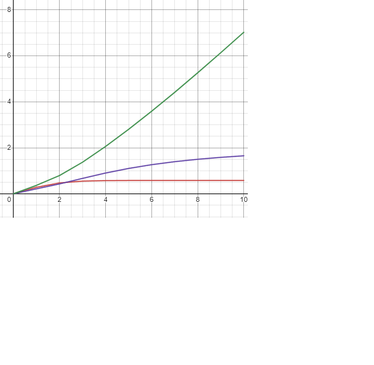

<p align="center">Министерство образования Республики Беларусь</p>
<p align="center">Учреждение образования</p>
<p align="center">“Брестский Государственный технический университет”</p>
<p align="center">Кафедра ИИТ</p>
<br><br><br><br><br><br>
<p align="center"><strong>Лабораторная работа №2</strong></p>
<p align="center"><strong>По дисциплине</strong> “Теория и методы автоматического управления”</p>
<p align="center"><strong>Тема:</strong> “ПИД-регуляторы”</p>
<br><br><br><br><br><br>
<p align="right"><strong>Выполнил</strong>:</p>
<p align="right">Студент 3 курса</p>
<p align="right">Группы АС-63</p>
<p align="right">Ярмолович А.С.</p>
<p align="right"><strong>Проверил:</strong></p>
<p align="right">Иванюк Д. С.</p>
<br><br><br><br><br>
<p align="center"><strong>Брест 2024</strong></p>

---
## Objective:
Write a C++ program that simulates the operation of a PID controller. Use the mathematical model from the previous work as the controlled object. Implement the program using an object-oriented approach, including at least three classes with inheritance. The report should include graphs demonstrating different target temperatures of the object and explanations of the results. 
## Work Progress:
A C++ program simulating the operation of a PID controller was implemented. Doxygen was used for program documentation, and the documentation was then converted to Markdown (.md).
---

<p align="center" style="font-size:25px;font-weight: bold">Вывод из консоли</p>

```console

  ---Линейная модель и Нелинейная модель---

Итерация 1: Выход линейной модели: 0.500000 Выход нелинейной модели: 0.284147 Ошибка: 0.215853 Управляющий сигнал: 0.366950

Итерация 2: Выход линейной модели: 0.900000 Выход нелинейной модели: 0.471095 Ошибка: 0.428905 Управляющий сигнал: 0.793894

Итерация 3: Выход линейной модели: 1.220000 Выход нелинейной модели: 0.550058 Ошибка: 0.669942 Управляющий сигнал: 1.375500

Итерация 4: Выход линейной модели: 1.476000 Выход нелинейной модели: 0.572912 Ошибка: 0.903088 Управляющий сигнал: 2.058610

Итерация 5: Выход линейной модели: 1.680800 Выход нелинейной модели: 0.578363 Ошибка: 1.102440 Управляющий сигнал: 2.802420

Итерация 6: Выход линейной модели: 1.844640 Выход нелинейной модели: 0.579586 Ошибка: 1.265050 Управляющий сигнал: 3.590220

Итерация 7: Выход линейной модели: 1.975710 Выход нелинейной модели: 0.579856 Ошибка: 1.395860 Управляющий сигнал: 4.412580

Итерация 8: Выход линейной модели: 2.080570 Выход нелинейной модели: 0.579915 Ошибка: 1.500650 Управляющий сигнал: 5.262510

Итерация 9: Выход линейной модели: 2.164460 Выход нелинейной модели: 0.579928 Ошибка: 1.584530 Управляющий сигнал: 6.134460

Итерация 10: Выход линейной модели: 2.231560 Выход нелинейной модели: 0.579931 Ошибка: 1.651630 Управляющий сигнал: 7.024030. . .
```

<p align="center" style="font-size:25px;font-weight: bold">Графики</p>
<p align="center">
<p align="center"> 
