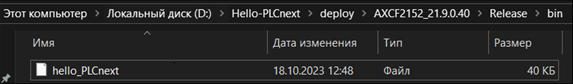
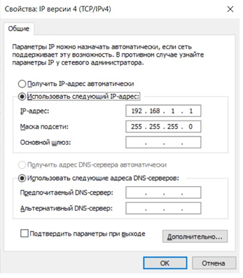
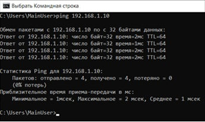
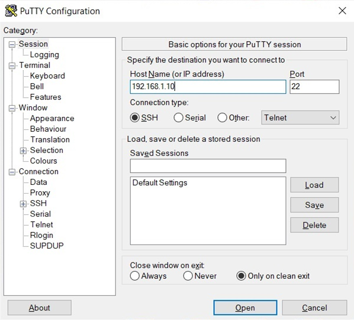
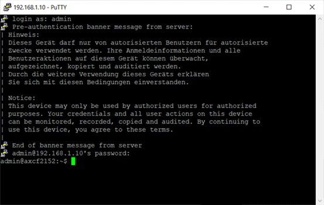
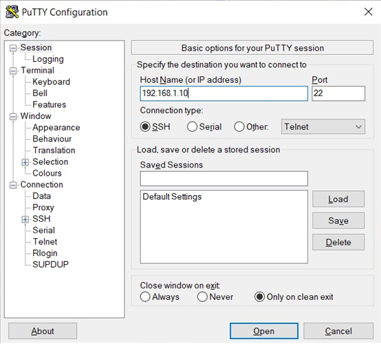
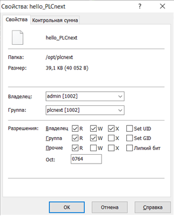
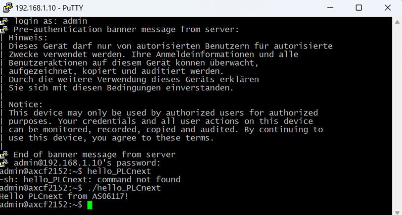
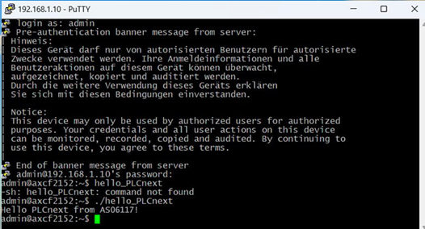

Министерство образования Республики Беларусь

Учреждение образования

“Брестский Государственный технический университет”

Кафедра ИИТ

      

<strong>Лабораторная работа №3</strong>

<strong>По дисциплине</strong> “Теория и методы автоматического управления”

<strong>Тема:</strong> “Работа с контроллером AXC F 2152”

      

<strong>Выполнил</strong>:

Студент 3 курса

Группы АС-63

Ярмолович А.C.

<strong>Проверил:</strong>

Иванюк Д. С.

     

<strong>Брест 2024</strong>

---
**Target:** use Visual Code and create a test project “Hello PLCnext from AS0xxyy!”, assemble it and show its functionality on a test controller.

**Exercise:**

1. Read general information about the platform **PLCnext**.
1. Explore [руководство](https://github.com/savushkin-r-d/PLCnext-howto/tree/master/HowTo%20build%20program%20Hello%20PLCnext).
1. Using **Visual Code** create a test project *"Hello PLCnext from AS0xxyy!"*,assemble it and demonstrate its functionality on a test controller.
1. Write a report on the work performed in .md format (readme.md) and use a pull request to place it in the following directory: trunk\as000xxyy\task_03\doc.

**Work progress:**

To complete the task, we initially need to assemble the *hello_PLCnext* file in Visual Studio. To do this you need to use the commands:

1) cmake --preset=build-windows-AXCF2152-2021.9.0.40 .
1) cmake --build --preset=build-windows-AXCF2152-2021.9.0.40 --target all .
1) cmake --build --preset=build-windows-AXCF2152-2021.9.0.40 --target install .\

We get a file «hello_PLCnext».
After completing this step, we go to the laboratory and connect to the controller via the Internet connection.

To connect to the controller, you first need to configure the network:

Then we check the connection to the controller:

Open the PuTTY Configuration program to connect to the controller:

Enter your login and password (specified on the controller itself) to connect to the controller:

Open the WinCP program and connect to the controller:

To launch the controller, add the assembled project to its root and change the resolution:

We run the project and get the output:

**Conclusion:** During this laboratory work, we created and assembled a test project and demonstrated its functionality on the controllerAXC F 2152.
