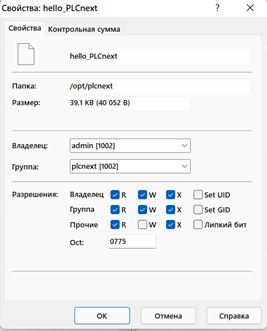
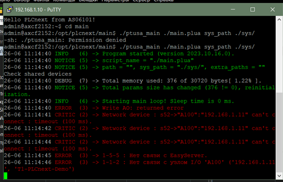
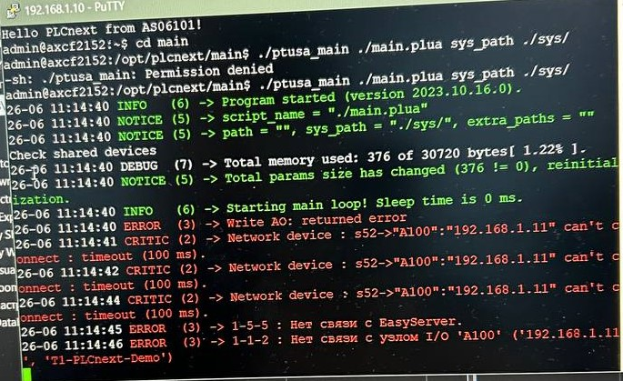

 Министерство образования Республики Беларусь 

Учреждение образования 

  “Брестский Государственный технический университет” 

 Кафедра ИИТ

   

 Лабораторная работа №4

 По дисциплине “Теория и методы автоматического управления”

 Тема: “Работа с контроллером AXC F 2152”

   

 Выполнила:

 Студентка 3 курса

 Группы АС-63

 Ярмолович А.C.

 Проверил:

Старший преподаватель

Иванюк Д.С.

   

Брест 2024

### <em> Purpose of the work: </em> 
Using the Visual Studio platform, build the ptusa_main project and demonstrate its functionality on a test controller.
 

### <em> Exercise: </em>  [4](../../../../tasks/task_04/readme.md)

### 
 <em> Work progress: </em> 

• First of all, I clone the ptusa_main repository. Next, I open this repository and get a project based on CMake. 

• I assemble the project using Visual Studio and then, as we did in laboratory work 3, I connect to the controller.

• After that, to run the executable file, I change the access rights:

 • And to run the executable file I use the command:

./ptusa_main  main.plua  sys_path  ./sys/ 

• Result and photo from the laboratory: 

### <em> Conclusion about the work: </em>
During the laboratory work, we learned how to assemble the project we needed using Visual Studio and demonstrated its functionality on a test controller.
