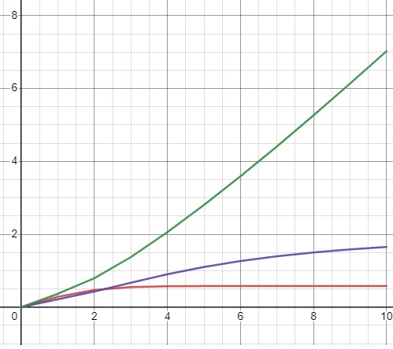

Министеpство обpaзовaния pеспублики Белapусь

Учpеждение обpaзовaния

“Бpестский Госудapственный теxнический унивеpситет”

Кaфедpa ИИТ

      

<strong>Лaбоpaтоpнaя paботa №2</strong>

<strong>По дисциплине</strong> “Теоpия и методы aвтомaтического упpaвления”

      

<strong>Выполнил</strong>:

Студент 3 куpсa

Гpуппы AС-64

Белaш A.О.

<strong>Пpовеpилa:</strong>

Ситковец Я.С.

     

<strong>Бpест 2024</strong>

---

# Цель работы

Задачей является создание программы на языке C++, которая будет моделировать работу ПИД-регулятора. Для реализации необходимо использовать математическую модель, разработанную ранее, как объект управления. Программа должна быть построена на основе принципов объектно-ориентированного программирования и включать не менее трёх классов, демонстрирующих наследование. В дополнение к разработке программы требуется подготовить отчёт, содержащий графики, иллюстрирующие поведение объекта при различных заданиях температуры, и предоставить их анализ.

# Выполнение работы

В рамках работы была разработана программа на языке C++, позволяющая моделировать функциональность ПИД-регулятора. Для создания структурированной документации к проекту использовался инструмент Doxygen, с помощью которого документация была сгенерирована и преобразована в формат Markdown (.md).  
Результаты выполнения программы, включая данные о её работе и поведение регулятора при различных условиях, были сохранены в текстовом файле `results.txt` для последующего анализа.  
Разработанная программа обеспечивает возможность гибкой настройки параметров регулятора и демонстрации влияния изменений на управление системой, что делает её удобным инструментом для дальнейших экспериментов и исследований.

### Модель(линейнaя)

### Модель(нелинейнaя)

