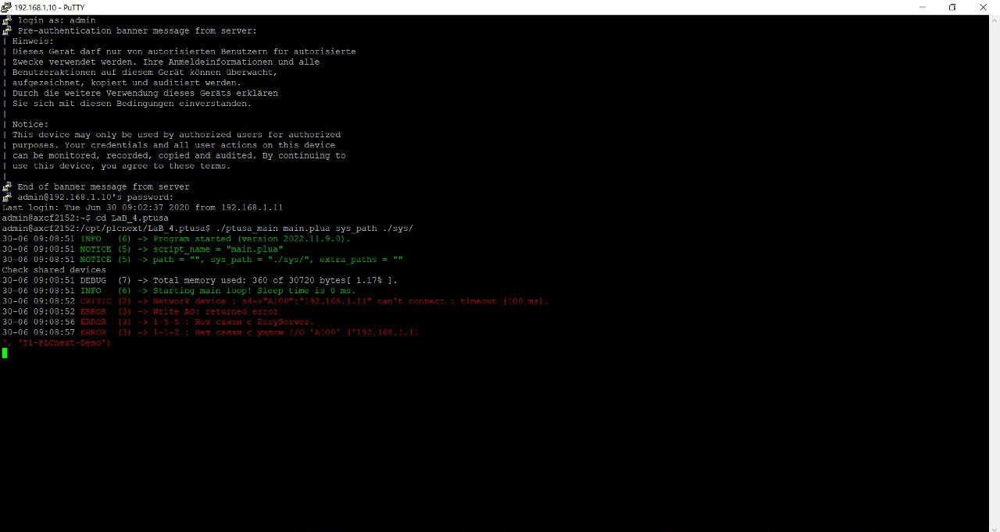

<p align="center">Министерство образования Республики Беларусь</p>
<p align="center">Учреждение образования</p>
<p align="center">“Брестский Государственный технический университет”</p>
<p align="center">Кафедра ИИТ</p>
<br><br><br><br><br><br>
<p align="center"><strong>Лабораторная работа №4</strong></p>
<p align="center"><strong>По дисциплине</strong> “Теория и методы автоматического управления”</p>
<br><br><br><br><br><br>
<p align="right"><strong>Выполнил</strong>:</p>
<p align="right">Студент 3 курса</p>
<p align="right">Группы АС-64</p>
<p align="right">Белаш А.О.</p>
<p align="right"><strong>Проверила:</strong></p>
<p align="right">Ситковец Я.С.</p>
<br><br><br><br><br>
<p align="center"><strong>Брест 2024</strong></p>

---
# Цель

**Цель:** используя *Visual Studio*, собрать данный проект и продемонстрировать его функциональность на тестовом контроллере.

# Решение

1. Согласно заданию лабораторной работы №4, клонируем репозиторий [ptusa_main](https://github.com/savushkin-r-d/ptusa_main).

2. Открываем весь репозиторий в Visual Studio. Таким образом, мы получаем проект на основе CMake.

3. С помощью Visual Studio собираем проект, используя инструмент сборки CMake.

4. Затем подключаемся к тестовому контроллеру AXC F 2152 в лаборатории.

5. Переходим в папку с проектом, предварительно перенесённую на контроллер, и запускаем программу.

6. Для скомпилированного файла `hello_PLCnext` задаём права доступа.

7. Теперь с помощью следующей команды получаем результат:

```
./ptusa_main main.plua sys_path ./sys/
```

