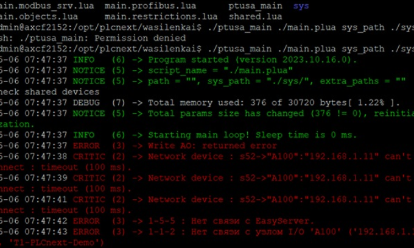

<p align="center">Министерство образования Республики Беларусь</p>
<p align="center">Учреждение образования</p>
<p align="center">“Брестский Государственный технический университет”</p>
<p align="center">Кафедра ИИТ</p>
<br><br><br><br><br><br>
<p align="center"><strong>Лабораторная работа №4</strong></p>
<p align="center"><strong>По дисциплине</strong> “Теория и методы автоматического управления”</p>
<p align="center"><strong>Тема:</strong> “Работа с контроллером AXC F 2152”</p>
<br><br><br><br><br><br>
<p align="right"><strong>Выполнил</strong>:</p>
<p align="right">Студент 3 курса</p>
<p align="right">Группы АС-64</p>
<p align="right">Булавский А.С.</p>
<p align="right"><strong>Проверила:</strong></p>
<p align="right">Ситковец Я.C.</p>
<br><br><br><br><br>
<p align="center"><strong>Брест 2024</strong></p>

---
<p> <strong>Цель:</strong> проект ptusa_main и продемонстрировать работоспособность на тестовом контроллере.</p>


 ``` bash
git clone --recurse-submodules https://github.com/savushkin-r-d/ptusa_main.git
```

После клонирования репозитория переходим к сборке проекта.

В результате получаем файл ptusa_main

После сборки исполняемого файла подключаемся к контроллеру через Ethernet-соединение.

После подключения и его проверки запускаем исполняемый файл.
