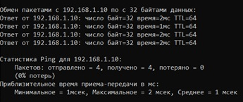
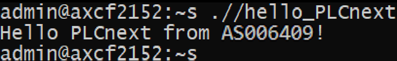

<p style="text-align: center;">Министерство образования Республики Беларусь</p>
<p style="text-align: center;">Учреждение образования</p>
<p style="text-align: center;">“Брестский Государственный технический университет”</p>
<p style="text-align: center;">Кафедра ИИТ</p>
<div style="margin-bottom: 10em;"></div>
<p style="text-align: center;">Лабораторная работа №3</p>
<p style="text-align: center;">По дисциплине “Теория и методы автоматического управления”</p>
<p style="text-align: center;">Тема: “Работа с контроллером AXC F 2152”</p>
<div style="margin-bottom: 10em;"></div>
<p style="text-align: right;">Выполнил:</p>
<p style="text-align: right;">Студент 3 курса</p>
<p style="text-align: right;">Группы АС-64</p>
<p style="text-align: right;">Евкович А. В.</p>
<p style="text-align: right;">Проверила:</p>
<p style="text-align: right;">Ситковец Я. С.</p>
<div style="margin-bottom: 10em;"></div>
<p style="text-align: center;">Брест 2024</p>

---

***Задание***:
1. Ознакомиться с общей информацией о платформе **PLCnext** [здесь](https://www.plcnext.help/te/About/Home.htm).
2. Изучить [руководство](https://github.com/savushkin-r-d/PLCnext-howto/tree/master/HowTo%20build%20program%20Hello%20PLCnext).
3. Используя **Visual Code** создать тестовый проект *"Hello PLCnext from AS0xxyy!"*, собрать его и продемонстрировать работоспособность на тестовом контроллере.
4. Написать отчет по выполненной работе в .md формате (readme.md) и с помощью pull request разместить его в следующем каталоге: trunk\as000xxyy\task_03\doc.
<br>
---

# Выполнение задания #
Согласно заданию, первым шагом будет клонирование репозитория.

Для компиляции файла hello_PLCnext применяем следующие команды:

```
cmake --preset=build-windows-AXCF2152-2021.0.3.35554 .
```

```
cmake --build --preset=build-windows-AXCF2152-2021.0.3.35554 --target all
```

```
cmake --build --preset=build-windows-AXCF2152-2021.0.3.35554 --target install
```

<p>Подключим контроллер и настраиваем сетевые параметры для взаимодействия с ним.</p>


<p>Проверка правильности соединения с контраллером.</p>



<p>В программе<em>PuTTY Configuration</em> подключаемся к контроллеру.</p>


<p>Вводим логин и пароль для доступа к контроллеру.</p>


<p>Запускаем <em>WinCP</em> и копируем собранный проект в корневую папку контроллера с изменением его разрешения для возможности запуска.</p>


<p>Запускаем проект</p>


