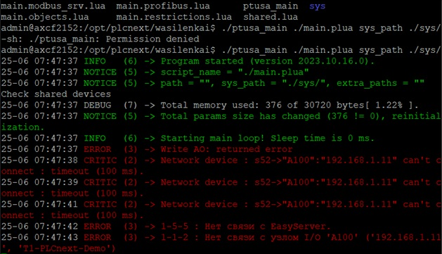

<p style="text-align: center;">Министерство образования Республики Беларусь</p>
<p style="text-align: center;">Учреждение образования</p>
<p style="text-align: center;">“Брестский Государственный технический университет”</p>
<p style="text-align: center;">Кафедра ИИТ</p>
<div style="margin-bottom: 10em;"></div>
<p style="text-align: center;">Лабораторная работа №4</p>
<p style="text-align: center;">По дисциплине “Теория и методы автоматического управления”</p>
<p style="text-align: center;">Тема: “Работа с контроллером AXC F 2152”</p>
<div style="margin-bottom: 10em;"></div>
<p style="text-align: right;">Выполнил:</p>
<p style="text-align: right;">Студент 3 курса</p>
<p style="text-align: right;">Группы АС-64</p>
<p style="text-align: right;">Евкович А. В.</p>
<p style="text-align: right;">Проверила:</p>
<p style="text-align: right;">Ситковец Я. С.</p>
<div style="margin-bottom: 10em;"></div>
<p style="text-align: center;">Брест 2024</p>

---

***Задание***:

1. Ознакомиться с общей информацией о платформе **PLCnext** [здесь](https://www.plcnext.help/te/About/Home.htm).
2. Изучить проект [ptusa_main](https://github.com/savushkin-r-d/ptusa_main).
3. Используя **Visual Studio** собрать данные проект и продемонстрировать работоспособность на тестовом контроллере.
4. Написать отчет по выполненной работе в .md формате (readme.md) и с помощью pull request разместить его в следующем каталоге: trunk\as000xxyy\task_04\doc.

---

# Выполнение задания #

<p>Сначала необходимо собрать проект <em>ptusa_main</em> в Visual Studio. Для этого клонируем git-репозиторий, используя следующую команду, которую записываем в терминале или в командной строке:</p>

```
git clone --recurse-submodules https://github.com/savushkin-r-d/ptusa_main.git
```

<p>Затем после клонирования получаем файл<em>ptusa_main</em>.</p>
<p>После сборки файла требуется установить соединение с контроллером через Ethernet.</p>
<p>Запускаем исполняемый файл только после того, как убедимся в установке соединения.</p>

