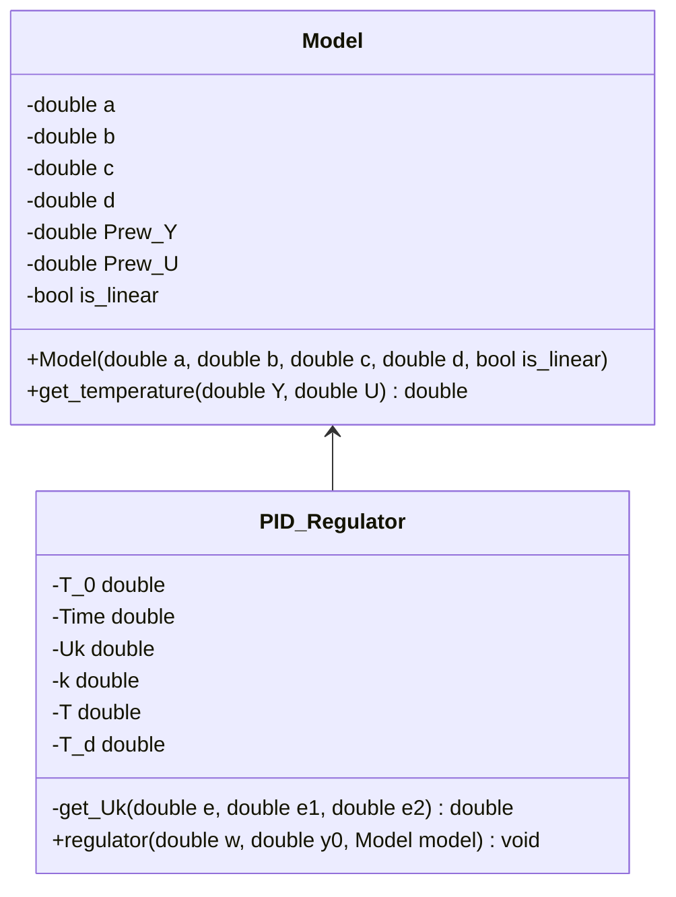

# Temperature Control System Documentation

## Overview
This program simulates a temperature control system using PID regulation, featuring both linear and nonlinear temperature models.

## Class Diagram



## Classes

### Model
Class implementing temperature system models (linear and nonlinear).

#### Members
- `a`: Model coefficient for current temperature
- `b`: Model coefficient for input signal (linear) or squared previous temperature (nonlinear)
- `c`: Model coefficient for input signal (nonlinear only)
- `d`: Model coefficient for sine of previous input (nonlinear only)
- `Prew_Y`: Previous temperature value
- `Prew_U`: Previous control signal
- `is_linear`: Flag indicating model type

#### Methods
- `Model(double a, double b, double c = 0, double d = 0, bool is_linear = true)`
  - Constructor initializing model parameters
  - **Parameters:**
    - `a`: Temperature coefficient
    - `b`: Input/squared temperature coefficient
    - `c`: Input signal coefficient (nonlinear)
    - `d`: Sine coefficient (nonlinear)
    - `is_linear`: Model type flag

- `double get_temperature(double Y, double U)`
  - Calculates system temperature
  - **Parameters:**
    - `Y`: Current temperature
    - `U`: Control signal
  - **Returns:** Calculated temperature

### PID_Regulator
Class implementing PID control algorithm.

#### Constants
- `T_0`: Sampling period (50)
- `Time`: Simulation duration (10)
- `k`: Controller gain (0.1)
- `T`: Integration time constant (10)
- `T_d`: Derivative time constant (10)

#### Members
- `Uk`: Control signal

#### Methods
- `void regulator(double w, double y0, Model& model)`
  - Executes PID control loop
  - **Parameters:**
    - `w`: Target temperature
    - `y0`: Initial temperature
    - `model`: Temperature model reference

- `double get_Uk(double e, double e1, double e2)`
  - Calculates control signal
  - **Parameters:**
    - `e`: Current error
    - `e1`: Previous error
    - `e2`: Second previous error
  - **Returns:** Updated control signal

## Implementation Details

### Linear Model
```cpp
Y = a * Y + b * U
```
where:
- Y: Temperature
- U: Control signal
- a, b: Model coefficients

### Nonlinear Model
```cpp
Y = a * Y - b * Prew_Y² + c * U + d * sin(Prew_U)
```
where:
- Y: Temperature
- U: Control signal
- Prew_Y: Previous temperature
- Prew_U: Previous control signal
- a, b, c, d: Model coefficients

### PID Algorithm
```cpp
q0 = k * (1 + Td/T0)
q1 = -k * (1 + 2*Td/T0 - T0/T)
q2 = k * Td/T0
Uk += q0*e + q1*e1 + q2*e2
```
where:
- k: Controller gain
- T: Integration time
- Td: Derivative time
- T0: Sampling period
- e, e1, e2: Current and previous errors

## Usage Example
```cpp
const double w = 10;    // Target temperature
const double y0 = 5;    // Initial temperature
const double a = 0.5;   // Temperature coefficient
const double b = 0.2;   // Input coefficient
const double c = 0.1;   // Nonlinear input coefficient
const double d = 0.05;  // Sine coefficient

Model linear_model{a, b, true};
Model nonlinear_model{a, b, c, d, false};
PID_Regulator pid_regulator;

pid_regulator.regulator(w, y0, nonlinear_model);
pid_regulator.regulator(w, y0, linear_model);
```

Would you like me to explain or break down anything specific about the documentation?