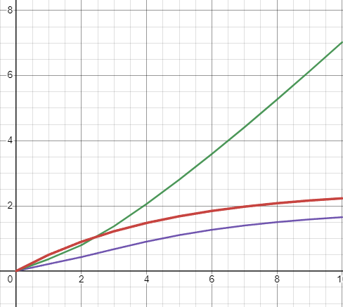
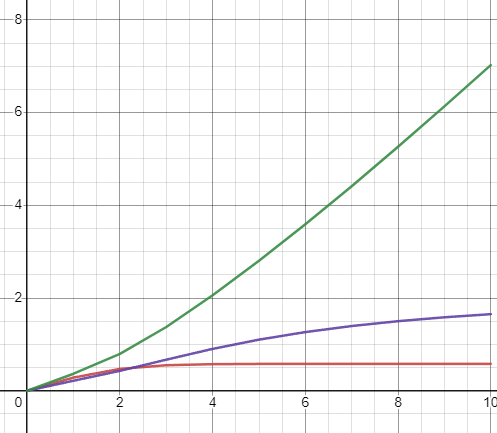

# Лабораторная работа №2              
<p align="center">Министерство образования Республики Беларусь</p>
<p align="center">Учреждение образования</p>
<p align="center">«Брестский государственный технический университет»</p>       
<p align="center">Кафедра ИИТ</p>
<br><br><br><br>
<p align="center">Лабораторная работа №2</p>
<p align="center">По дисциплине: «ТИМАУ»</p>
<br><br><br>
<p align="right">Выполнил</p> 
<p align="right">Студент 3-го курса</p>
<p align="right">Группы АС-64</p>
<p align="right">Иванюк И.А.</p>
<p align="right">Проверил</p>
<p align="right">Иванюк Д.С.</p>
<br><br><br>
<p align="center">Брест 2024</p>

---

**Задание.**
1.  На C++  реализовать программу, моделирующую рассмотренный выше ПИД-регулятор.  В качестве объекта управления использовать математическую модель, полученную в предыдущей работе. Использовать ООП, в программе должно быть не менее 3-х классов (+наследование).
2.  Написать отчет по выполненной лабораторной работе №2 в .md формате (*readme.md*) и с помощью **pull request** разместить его в следующем каталоге: **trunk\as000xxyy\task_02\doc**. В отчете также привести графики для разных заданий температуры объекта, пояснить полученные результаты.
3.  В отчет с помощью [Doxygen](https://doxygen.nl/) (в .md формате) добавить информацию о разработанной программе (диаграмма классов и т.п.).
4.  Исходный код написанной программы разместить в каталоге: **trunk\as000xxyy\task_02\src**.

#### Результат:
```console
Not Linear mode
E = 5, Yt = 2.56, Uk = 0.6
E = 7.44, Yt = -2.14249, Uk = 3.2928
E = 12.1425, Yt = -1.7547, Uk = 7.5283
E = 11.7547, Yt = -1.10673, Uk = 13.459
E = 11.1067, Yt = -0.534434, Uk = 19.2663
E = 10.5344, Yt = -0.00336448, Uk = 24.764
E = 10.0034, Yt = 0.479865, Uk = 29.9789
E = 9.52013, Yt = 0.943768, Uk = 34.9332
E = 9.05623, Yt = 1.44638, Uk = 39.6473
E = 8.55362, Yt = 1.95892, Uk = 44.1244
Linear mode
E = 5, Yt = 2.62, Uk = 0.6
E = 7.38, Yt = 3.15712, Uk = 3.2856
E = 6.84288, Yt = 3.87271, Uk = 6.86355
E = 6.12729, Yt = 4.54197, Uk = 10.2099
E = 5.45803, Yt = 5.1415, Uk = 13.2075
E = 4.8585, Yt = 5.67559, Uk = 15.878
E = 4.32441, Yt = 6.15102, Uk = 18.2551
E = 3.84898, Yt = 6.57419, Uk = 20.3709
E = 3.42581, Yt = 6.95083, Uk = 22.2542
E = 3.04917, Yt = 7.28607, Uk = 23.9303
```

 