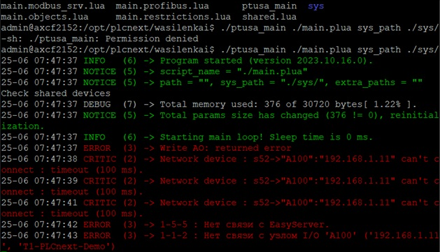

# Лабораторная работа №4              
<p align="center">Министерство образования Республики Беларусь</p>
<p align="center">Учреждение образования</p>
<p align="center">«Брестский государственный технический университет»</p>       
<p align="center">Кафедра ИИТ</p>
<br><br><br><br>
<p align="center">Лабораторная работа №4</p>
<p align="center">По дисциплине: «ТИМАУ»</p>
<p align="center">Тема:</strong> “Работа с контроллером AXC F 2152”</p>
<br><br><br>
<p align="right">Выполнил</p> 
<p align="right">Студент 3-го курса</p>
<p align="right">Группы АС-64</p>
<p align="right">Иванюк И.А.</p>
<p align="right">Проверил</p>
<p align="right">Иванюк Д.С.</p>
<br><br><br>
<p align="center">Брест 2024</p>

---

**Задание.**
1. Ознакомиться с общей информацией о платформе **PLCnext** [здесь](https://www.plcnext.help/te/About/Home.htm).
2. Изучить проект [ptusa_main](https://github.com/savushkin-r-d/ptusa_main).
3. Используя **Visual Studio** собрать данные проект и продемонстрировать работоспособность на тестовом контроллере.
4. Написать отчет по выполненной работе в .md формате (readme.md) и с помощью pull request разместить его в следующем каталоге: trunk\as000xxyy\task_04\doc.

#### Решение:
<p>Собираемть файл <em>ptusa_main</em> в VS. Копируем репозиторий, команды для этого:</p>

 ``` bash
git clone --recurse-submodules https://github.com/savushkin-r-d/ptusa_main.git
```

<p>Собираем проект и видим на выходе: <em>ptusa_main</em>.</p>

<p>Файл склеиваем с контроллером с использованием интернета</p>

<p>Дальше:</p>
<p>Проверка подключения</p>
<p>Запуск файла</p>

<p align="center">