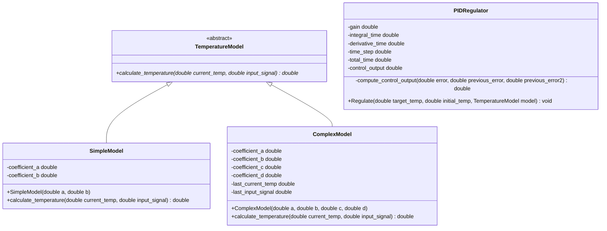

# Temperature Regulation Simulation Documentation

## Overview
This program implements a temperature regulation simulation using PID control. It includes two types of temperature models:
- A simple linear model
- A complex nonlinear model

## Class Diagram



## Classes

### TemperatureModel
Abstract base class that defines the interface for temperature models.

#### Methods
- `virtual double calculate_temperature(double current_temp, double input_signal) = 0`
  - Calculates the resulting temperature based on current temperature and input signal
  - **Parameters:**
    - `current_temp`: The current temperature
    - `input_signal`: The control output from PID controller
  - **Returns:** Calculated temperature

### SimpleModel
Implements a linear temperature model.

#### Members
- `coefficient_a`: Coefficient influencing the current temperature
- `coefficient_b`: Coefficient influencing the input signal

#### Methods
- `SimpleModel(double a, double b)`
  - Constructor
  - **Parameters:**
    - `a`: Coefficient for current temperature
    - `b`: Coefficient for input signal

- `double calculate_temperature(double current_temp, double input_signal)`
  - Implements linear temperature calculation
  - **Parameters:**
    - `current_temp`: Current temperature
    - `input_signal`: Control output
  - **Returns:** Computed temperature

### ComplexModel
Implements a nonlinear temperature model.

#### Members
- `coefficient_a`: Coefficient influencing the current temperature
- `coefficient_b`: Coefficient influencing the square of last current temperature
- `coefficient_c`: Coefficient influencing the input signal
- `coefficient_d`: Coefficient influencing the sine of last input signal
- `last_current_temp`: Previous current temperature
- `last_input_signal`: Previous input signal

#### Methods
- `ComplexModel(double a, double b, double c, double d)`
  - Constructor
  - **Parameters:**
    - `a`: Coefficient for current temperature
    - `b`: Coefficient for last current temperature
    - `c`: Coefficient for input signal
    - `d`: Coefficient for sine function of last input signal

- `double calculate_temperature(double current_temp, double input_signal)`
  - Implements nonlinear temperature calculation
  - **Parameters:**
    - `current_temp`: Current temperature
    - `input_signal`: Control output
  - **Returns:** Computed temperature

### PIDRegulator
Implements PID control algorithm for temperature regulation.

#### Constants
- `gain`: Proportional gain (0.1)
- `integral_time`: Integral time constant (10)
- `derivative_time`: Derivative time constant (80)
- `time_step`: Time step for simulation (50)
- `total_time`: Total simulation time (30)

#### Members
- `control_output`: Control output value

#### Methods
- `void Regulate(double target_temp, double initial_temp, TemperatureModel& model)`
  - Regulates temperature to reach target
  - **Parameters:**
    - `target_temp`: Desired target temperature
    - `initial_temp`: Initial temperature
    - `model`: Temperature model used for regulation

- `double compute_control_output(double error, double previous_error, double previous_error2)`
  - Computes control output using PID algorithm
  - **Parameters:**
    - `error`: Current error
    - `previous_error`: Previous error
    - `previous_error2`: Second previous error
  - **Returns:** Computed control output

## Helper Functions

### input_parameters
```cpp
void input_parameters(double& a, double& b, double& c, double& d, bool is_complex)
