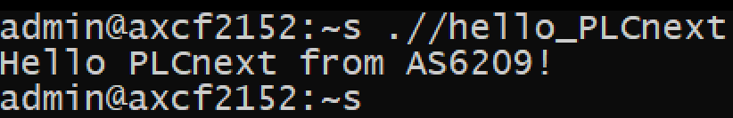

                        Ministry of Education of the Republic of Belarus

                                        Educational Institution

                                 “Brest State Technical University”

                        Department of Information and Intelligent Technologies


                                          Laboratory work №3

                        On the discipline “Theory and methods of automatic control”

                                Topic: "Work with controller AXC F 2152”


                                                                Performed by:

                                                                Student of the 3rd course

                                                                Group AS-64

                                                                Kuzhyr U. V.

                                                                Supervised by:

                                                                Sitkovets J. S.


                                             Brest 2024

## Task:

- Ознакомиться с общей информацией о платформе PLCnext здесь.

- Изучить руководство.

- Используя Visual Code создать тестовый проект "Hello PLCnext from AS0xxyy!", собрать его и продемонстрировать работоспособность на тестовом контроллере.

- Написать отчет по выполненной работе в .md формате (readme.md) и с помощью pull request разместить его в следующем каталоге: trunk\as000xxyy\task_03\doc.

clonning a [repository](https://github.com/savushkin-r-d/PLCnext-howto/tree/master)

Execute 3 commands:

1. ```bash
   cmake --preset=build-windows-AXCF2152-2021.0.3.35554 .
   ```

2. ```bash
   cmake --build --preset=build-windows-AXCF2152-2021.0.3.35554 --target all
   ```

3. ```bash
   cmake --build --preset=build-windows-AXCF2152-2021.0.3.35554 --target install
   ```

Connect the controller and configure the network settings.


Make sure that the connection to the controller is established correctly


Open the PuTTY Configuration program and connect to the controller

 

Enter the login and password to access the controller.

 

Start WinCP to connect to the controller.

  

Copy the assembled project to the root folder of the controller and change its permissions to allow it to run.


Run the project and get the output. 

   
