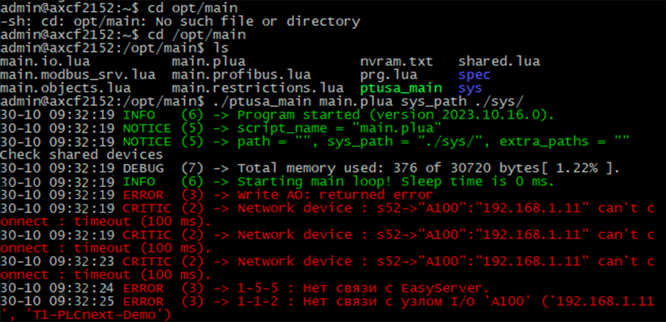

                        Ministry of Education of the Republic of Belarus

                                        Educational Institution

                                 “Brest State Technical University”

                        Department of Information and Intelligent Technologies


                                          Laboratory work №4

                        On the discipline “Theory and methods of automatic control”

                                Topic: "Work with controller AXC F 2152”


                                                                Performed by:

                                                                Student of the 3rd course

                                                                Group AS-64

                                                                Kuzhyr U. V.

                                                                Supervised by:

                                                                Sitkovets J. S.


                                             Brest 2024

---
## Задание:
Работа с контроллером AXC F 2152

   Ознакомиться с общей информацией о платформе PLCnext [здесь](https://www.plcnext.help/te/About/Home.htm).

   Изучить проект ptusa_main.

   Используя Visual Studio собрать данные проект и продемонстрировать работоспособность на тестовом контроллере.

   Написать отчет по выполненной работе в .md формате (readme.md) и с помощью pull request разместить его в следующем каталоге: trunk\as000xxyy\task_04\doc.


## Ход работы

Preparation

Cloning the Repository:

```sh
git clone --recurse-submodules https://github.com/savushkin-r-d/ptusa_main
```

```sh
git config --global http.postBuffer 524288000
```

Download and Install PLCnext Technology C++ Toolchain:

   - Download the latest version of the PLCnext Technology C++ Toolchain (version 2023.0 LTS) from the Phoenix Contact website -> phoenixcontact.com.

   - Install the PLCnext Technology C++ Toolchain using Visual Studio Installer, ensuring the .NET desktop development workload is installed.

Download and Install the SDK:

   - Download the SDK -> phoenixcontact.com.

   - Install the SDK using the following command:

```sh
plcncli.exe install sdk –d [installation path] –p [path to archive file]
```
Example:

        plcncli.exe install sdk –d C:\CLI\sdks\AXCF2152\ –p C:\Users\kseni\Downloads\SDK_for_Windows_64_V_2022_6\pxc-glibc-x86_64-mingw32-axcf2152-image-mingw-cortexa9t2hf-neon-axcf2152-toolchain-2022.6.tar.xz

### Project Build

With the setup complete, proceed to build the project in Microsoft Visual Studio Community 2022. Select the launch target ptusa_main.exe.
Connection and Configuration

Next, follow the instructions in the section Connection and Configuration Stage from Lab Work No. 3 until a successful login is achieved.

After that, create a directory on the controller's root directory, e.g., /opt/main/, and transfer the .lua and .plua files, along with the spec and sys directories from the T1-PLCnext-Demo project and the executable file to the controller using WinSCP.


### Running the Program

To run the program, use the following command:

./ptusa_main main.plua sys_path ./sys/


Conclusion

The project was successfully built and tested on a test controller. The program's output displays correctly.