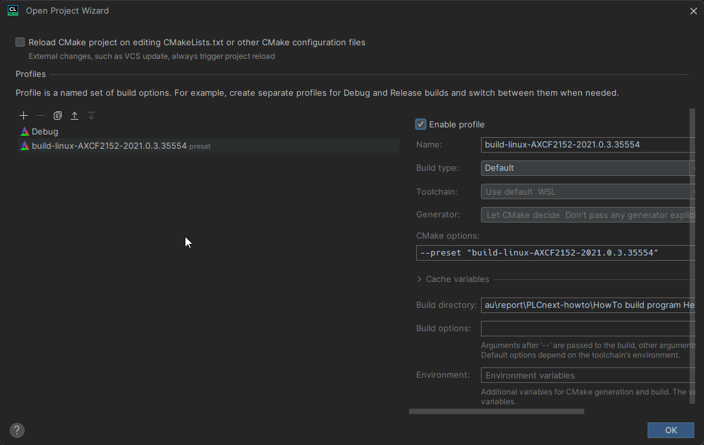
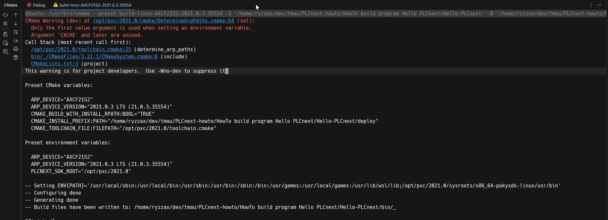
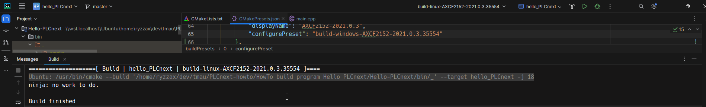
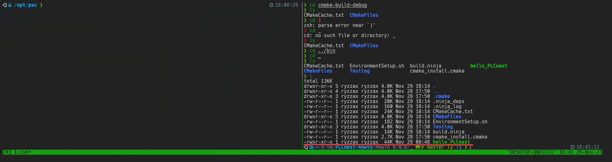
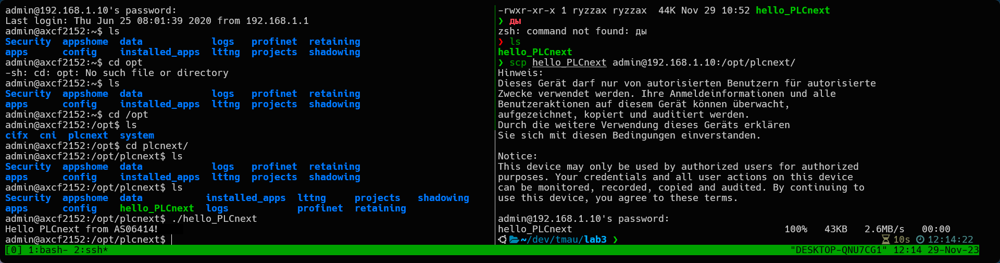

<p align="center">Министерство образования Республики Беларусь</p>
<p align="center">Учреждение образования</p>
<p align="center">«Брестский государственный технический университет»</p>       
<p align="center">Кафедра ИИТ</p>
<br><br><br><br>
<p align="center">Лабораторная работа №3</p>
<p align="center">По дисциплине: «ТиМАУ»</p>
<br><br><br>
<p align="right">Выполнил</p>
<p align="right">Студент 3-го курса</p>
<p align="right">Группы АС-64</p>
<p align="right">Немирович Д.А.</p>
<p align="right">Проверила</p>
<p align="right">Ситковец Я.С.</p>
<br><br><br>
<p align="center">Брест 2024</p>

---

## Цель работы
1. Изучить возможности платформы PLCnext.  
2. Ознакомиться с руководством пользователя для работы с платформой.  
3. Разработать тестовый проект под названием "Hello PLCnext from AS0xxyy!".  
4. Собрать проект и показать его выполнение на тестовом контроллере AXC F 2152.

## Ход работы

1. Клонируем репозиторий проекта *Hello PLCnext* с использованием команды:  

```
git clone https://github.com/savushkin-r-d/PLCnext-howto/tree/master
```  

2. Выполняем сборку с помощью встроенных инструментов CMake в среде разработки CLion.  
3. Подключаем профиль CMake для настройки сборки.



4. Результат конфигурации профиля и сборки проекта, где на выходе получим исполняемый файл hello_PLCnext.





5. Далее выполните запуск файла на контроллере. На представленном изображении показан процесс передачи и запуска файла. В правой части терминала отображается результат выполнения команды `scp`, которая используется для передачи файла на контроллер через протокол SSH. В левой части показано подключение к контроллеру и вывод результата работы программы.



Во время выполнения работы возникла проблема с подключением контроллера к ноутбуку через Ethernet. Хотя кабель был подключен правильно, контроллер не отображался среди доступных сетевых устройств.  

Для устранения проблемы я проверил настройки сетевых адаптеров ноутбука. Выяснилось, что конфигурация Ethernet-адаптера была некорректной. Ознакомившись с документацией контроллера, я настроил сетевое соединение в соответствии с рекомендациями производителя.  

После корректировки параметров сетевого адаптера подключение контроллера к ноутбуку по Ethernet прошло успешно, что позволило продолжить выполнение лабораторных работ и завершить проект.

---

**Вывод**: В результате выполнения данной лабораторной работы были приобретены навыки работы с контроллером AXC F 2152.
