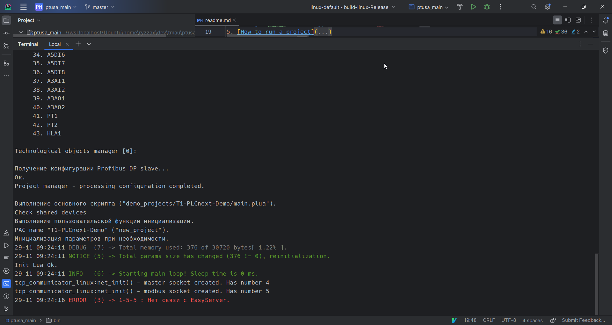
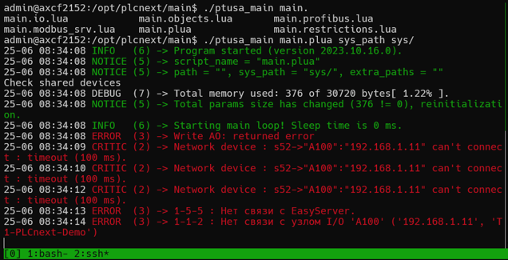

<p align="center">Министерство образования Республики Беларусь</p>
<p align="center">Учреждение образования</p>
<p align="center">«Брестский государственный технический университет»</p>       
<p align="center">Кафедра ИИТ</p>
<br><br><br><br>
<p align="center">Лабораторная работа №4</p>
<p align="center">По дисциплине: «ТиМАУ»</p>
<br><br><br>
<p align="right">Выполнил</p>
<p align="right">Студент 3-го курса</p>
<p align="right">Группы АС-64</p>
<p align="right">Немирович Д.А.</p>
<p align="right">Проверила</p>
<p align="right">Ситковец Я.С.</p>
<br><br><br>
<p align="center">Брест 2024</p>

---

## Цель работы

- Собрать проект [ptusa_main](https://github.com/savushkin-r-d/ptusa_main) и продемонстрировать его работоспособность на контроллере.

## Ход работы

1. Клонируем проект [ptusa_main](https://github.com/savushkin-r-d/ptusa_main) и собираем в исполняемый файл.



2. Переносим исполняемый файл вместе с демо проектом T1-PLCnext-Demo в файловую систему контроллера с помощью scp как это было сделано в предыдущей лаборотоной работе

3. Запускаем бинарный файл в сессии ssh с помощью команды ```./ptusa_main  main.plua  sys_path ./sys/```



---

## Вывод

В рамках лабораторной работы были изучены основные сведения о платформе PLCnext и выполнен запуск проекта *ptusa_main* на контроллере.