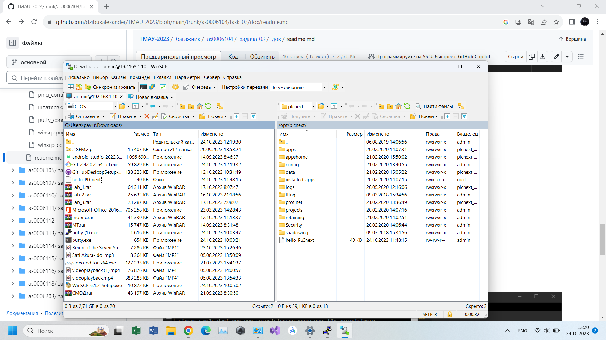
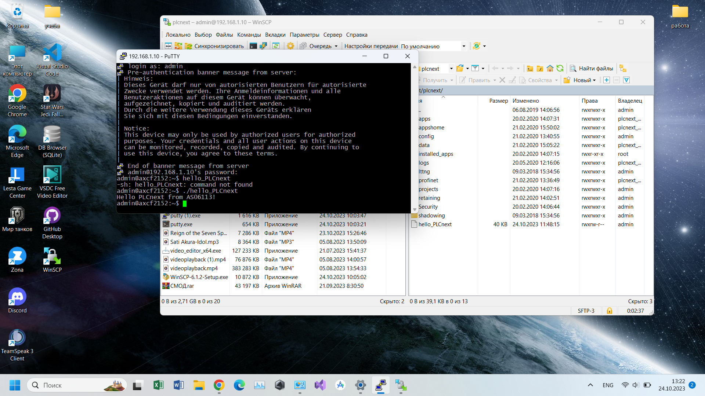

Министерство образования Республики Беларусь

Учреждение образования

«Брестский государственный технический университет»

Кафедра ИИТ

    

Лабораторная работа №3

По дисциплине: «ТИМАУ»

   

Выполнил

Студент 3-го курса

Группы АС-64

Попов А.С.

Проверила

Ситковец Я.С.

   

Брест 2024

---

**Цель**: создать и собрать тестовый проект "Hello PLCnext from AS0xxyy!", а затем продемонстрировать его работу на тестовом контроллере.

Порядок выполнения:

Для начала нужно собрать файл hello_PLCnext с помощью Visual Studio. Для этого выполняются следующие команды:

1. cmake --preset=build-windows-AXCF2152-2021.9.0.40 .
2. cmake --build --preset=build-windows-AXCF2152-2021.9.0.40 --target all .
3. cmake --build --preset=build-windows-AXCF2152-2021.9.0.40 --target install .

В результате получаем файл hello_PLCnext.

После успешной сборки исполняемого файла подключаемся к контроллеру через Ethernet-соединение для дальнейшей работы.

Проверка подключения контроллера.

Запускаем программу PuTTY Configuration, подключаемся к контроллеру, вводим логин и пароль, а затем открываем WinSCP для дальнейшего подключения к тому же контроллеру.

Копируем собранный проект в корневую директорию контроллера и изменяем его разрешения для возможности запуска, а затем запускаем

**Вывод**: В результате выполнения работы был успешно создан и собран тестовый проект "Hello PLCnext from AS0xxyy!". После сборки проекта с использованием команд CMake, был подключен контроллер через Ethernet-соединение. Далее с помощью программ PuTTY Configuration и WinSCP выполнено подключение к контроллеру для загрузки проекта. Собранный файл был размещен в корневой директории контроллера и настроены соответствующие разрешения для его запуска. 

Все этапы были успешно выполнены, что подтверждает работоспособность проекта на тестовом контроллере.