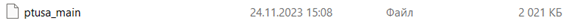
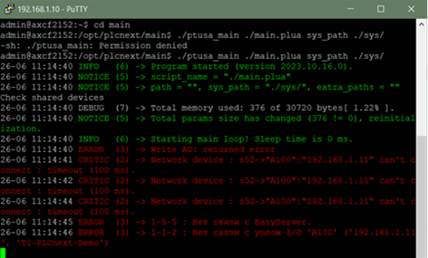

<p align="center">Министерство образования Республики Беларусь</p>
<p align="center">Учреждение образования</p>
<p align="center">«Брестский государственный технический университет»</p>
<p align="center">Кафедра ИИТ</p>
<br><br><br><br>
<p align="center">Лабораторная работа №4</p>
<p align="center">По дисциплине: «ТИМАУ»</p>
<br><br><br>
<p align="right">Выполнил</p>
<p align="right">Студент 3-го курса</p>
<p align="right">Группы АС-64</p>
<p align="right">Попов А.С.</p>
<p align="right">Проверила</p>
<p align="right">Ситковец Я.С.</p>
<br><br><br>
<p align="center">Брест 2024</p>

---

**Цель**: Ознакомиться с проектом [ptusa_main](https://github.com/savushkin-r-d/ptusa\_main), собрать его с использованием Visual Studio, продемонстрировать его функционирование на тестовом контроллере. Составить отчет о проделанной работе в формате .md и разместить его в нужном каталоге через pull request.

### Задание:

1. Изучить общую информацию о платформе **PLCnext**.
2. Ознакомиться с проектом ptusa_main.
3. Собрать проект с использованием **Visual Studio** и продемонстрировать его работоспособность на тестовом контроллере.
4. Составить отчет о выполненной работе в формате .md (readme.md) и через pull request разместить его в каталоге: trunk\as000xxyy\task\_04\doc.

### Ход работы:

1. Для начала нам нужно клонировать [репозиторий](https://github.com/savushkin-r-d/ptusa\_main).
2. Чтобы это сделать мы используем команду:

```
git clone --recurse-submodules https://github.com/savushkin-r-d/ptusa\_main.git
```

3. После клонирования репозитория, открываем проект в Visual Studio и выполняем сборку, в результате чего получаем файл:



4. После получения необходимого файла подключаемся к контроллеру аналогично тому, как это было сделано в третьей лабораторной работе, а затем запускаем файл.



---

## Результаты работы
Ознакомились с проектом [ptusa_main](https://github.com/savushkin-r-d/ptusa\_main), собрали его с помощью Visual Studio и проверили его работу на тестовом контроллере. Составили отчет в формате .md и разместили его в нужном каталоге через pull request.